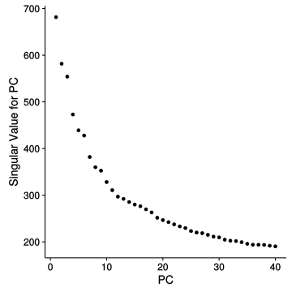
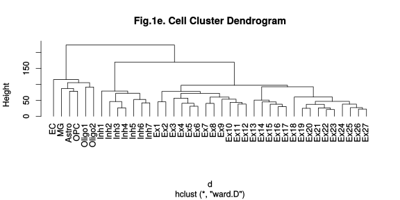
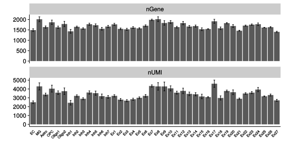
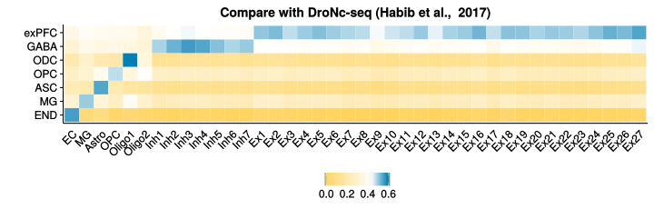
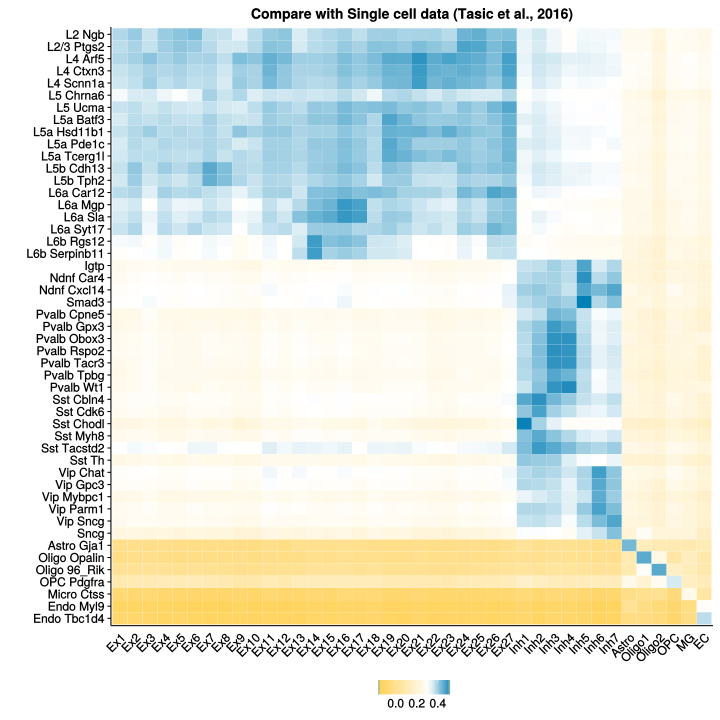
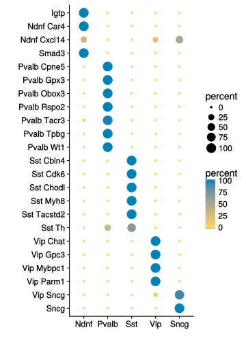

```r
library("Seurat")
packageVersion("Seurat") # check the Seurat version (We used v1.4.0)
```

```
## [1] '1.4.0'
```

```r
library("tidyr")
library("dplyr")
```

```
## 
## Attaching package: 'dplyr'
```

```
## The following object is masked from 'package:Seurat':
## 
##     arrange
```

```
## The following objects are masked from 'package:stats':
## 
##     filter, lag
```

```
## The following objects are masked from 'package:base':
## 
##     intersect, setdiff, setequal, union
```

```r
library("reshape2")
```

```
## 
## Attaching package: 'reshape2'
```

```
## The following object is masked from 'package:tidyr':
## 
##     smiths
```

# 1. Clustering and marker gene identification
## 1.1. Initial clustering
### 1.1.1. Load the digital expression matrics and cell Info

```r
tmp1 <- readRDS(file = "data/combined_raw_nUMI_matrix.rds")
dat.info <- readRDS("data/nuclei_info.rds")
```

### 1.1.2 Setup the Initial Seurat object (20858 nuclei)


### 1.1.3. Add the animal identity information 

```r
df <- scNuc@data.info
df$cell <- rownames(df)
df <- df %>% left_join(dat.info, by = "cell")
head(df)
rownames(df) <- df$cell
head(df)
str(df)
table(df$type)
scNuc@data.info <- df
table(scNuc@data.info$ID)
scNuc@data.info$ID <- as.factor(scNuc@data.info$ID)
```

### 1.1.4. Regression, PCA analysis and Jackstraw (x.low.cutoff = 0.0125, x.high.cutoff = 4, y.cutoff = 0.8, 1932 highly variable genes)

```r
scNuc <- RegressOut(scNuc, latent.vars = c("percent.mito", "nUMI", "ID"))
scNuc <- MeanVarPlot(scNuc, x.low.cutoff = 0.0125, x.high.cutoff = 4, y.cutoff = 0.8)
length(scNuc@var.genes)  # 1932 highly variable genes
scNuc <- PCAFast(scNuc, pc.genes = scNuc@var.genes, do.print = TRUE, pcs.compute = 40, 
    pcs.print = 5, genes.print = 5)
scNuc <- ProjectPCA(scNuc)
scNuc <- JackStraw(scNuc, num.pc = 40, num.replicate = 100, prop.freq = 0.01, 
    do.fast = T, do.print = FALSE)  # this step will take a while
```


```r
PCElbowPlot(scNuc, num.pc = 40)
```



```r
JackStrawPlot(scNuc, PCs = 1:40)
```

```
## Warning: Removed 54272 rows containing missing values (geom_point).
```


### 1.1.5. Select PCs and clustering (Select 1:30 PCs and res=2 to cluster the nuclei which leads to 32 clusters)

```r
cluster_pc_res = function(t, pcs = 1:30, res = 2) {
    t <- RunTSNE(t, dims.use = pcs, do.fast = T)
    t <- FindClusters(t, pc.use = pcs, resolution = res, save.SNN = T, do.sparse = T)
}

scNuc.pc30 <- cluster_pc_res(scNuc, pcs = 1:30)
```

### 1.1.6. Vlnplot and Heatmap plot function

```r
library("reshape2")
plot_vln <- function(t, my.genes3) {
    d <- as.matrix(t@data[intersect(my.genes3, rownames(t@data)), ])
    dd <- melt(d, id = row.names)
    dd <- dd %>% dplyr::rename(gene = Var1, cell = Var2)
    dd$tree.ident <- t@ident[dd$cell]
    str(dd$tree.ident)
    dd$gene <- factor(dd$gene, levels = intersect(my.genes3, rownames(t@data)))
    ggplot(dd, aes(tree.ident, value, fill = tree.ident)) + geom_violin(scale = "width", 
        trim = T, alpha = 0.8, adjust = 1) + facet_wrap(~gene, scales = "free_y", 
        ncol = 1, strip.position = "right") + theme(strip.background = element_blank(), 
        strip.placement = "outside", axis.text.y = element_blank(), axis.title.y = element_blank(), 
        strip.text.y = element_text(colour = "red", angle = 360, size = 10), 
        legend.position = "none", panel.grid = element_blank(), panel.border = element_blank()) + 
        theme(axis.text.x = element_text(angle = 45, hjust = 1, vjust = 1, size = rel(0.9)), 
            legend.position = "none") + xlab("")
}
```


```r
library("gplots")
```

```
## 
## Attaching package: 'gplots'
```

```
## The following object is masked from 'package:stats':
## 
##     lowess
```

```r
my.colours = c("#313695", "#4575B4", "#74ADD1", "#ABD9E9", "#E0F3F8", "#FFFFFF", 
    "#FEE090", "#FDAE61", "#F46D43", "#D73027", "#A50026")
plot_heatmap = function(t, my.genes7, my.colours = my.colours, COL = T, ROW = T, 
    DEND = "none") {
    my.genes6 <- intersect(unique(my.genes7), rownames(t@data))
    Mat <- t@data[unique(my.genes6), ]
    Mat <- as.data.frame(as.matrix(Mat))
    Mat$gene <- rownames(Mat)
    Mat <- melt(Mat, id = "gene")
    Mat$cluster <- t@ident[Mat$variable]
    Mat <- Mat %>% group_by(gene, cluster) %>% dplyr::summarise(meanExp = mean(value)) %>% 
        ungroup
    Mat <- as.data.frame(Mat)
    Mat <- dcast(Mat, gene ~ cluster, value.var = "meanExp")
    rownames(Mat) <- Mat$gene
    Mat <- as.matrix(Mat[, -1])
    Mat <- t(scale(t(Mat)))
    Mat <- Mat[unique(my.genes6), levels(t@ident)]
    Mat <- na.omit(Mat)
    heatmap.2(Mat, Colv = COL, Rowv = ROW, dendrogram = DEND, scale = "none", 
        trace = "none", density.info = "none", col = my.colours)
}
```

### 1.1.7. Identify the contamination from STR


```r
TSNEPlot(scNuc.pc30, do.label = T, pt.size = 0.2, no.legend = T, do.ret = T)
```


```r
my.genes1 <- c("Slc17a7", "Cux2", "Tle4", "Rorb", "Gad1", "Mbp", "Pdgfra", "Flt1", 
    "Snap25", "Gad2", "Vip", "Sst", "Pvalb", "Apoe", "Gja1", "Mog", "Ctss", 
    "Enpp2", "Ctgf", "Ppp1r1b", "Meis2")
plot_vln(scNuc.pc30, my.genes1)
```

```
##  Factor w/ 32 levels "0","1","2","3",..: 7 7 7 7 7 7 7 7 7 7 ...
```


```r
FeaturePlot(scNuc.pc30,c("Ppp1r1b","Meis2"),cols.use = c("lightgrey","blue"),pt.size=.5,no.axes = T)
```


```r
# Select 30 PCs, remove cells from STR (cluster 9 and 10) and mixed cells
# (28 and 31)
useless.cells <- names(scNuc.pc30@ident[scNuc.pc30@ident %in% c(9, 10, 28, 31)])
used.cells <- setdiff(names(scNuc.pc30@ident), useless.cells)
length(used.cells)
tmp2 <- tmp1[, used.cells]
# Setup the Serurat object
scNuc2 <- setupSer(tmp2, "scNucDrop-seq")
mito.genes <- grep("^MT-", rownames(scNuc2@data), value = T, ignore.case = T)
percent.mito <- colSums(as.matrix(expm1(scNuc2@data[mito.genes, ])))/colSums(as.matrix(expm1(scNuc2@data)))
scNuc2 <- AddMetaData(scNuc2, percent.mito, "percent.mito")
scNuc2
scNuc2 <- SubsetData(scNuc2, subset.name = "nGene", accept.high = 6000)
scNuc2 <- SubsetData(scNuc2, subset.name = "percent.mito", accept.high = 0.1)
scNuc2
```

## 1.2. Second round of clustering w/o STR nuclei
### 1.2.1 Identify highly virable genes, PCA and clustering

```r
df <- scNuc2@data.info
df$cell <- rownames(df)
df <- df %>% left_join(dat.info, by = "cell")
head(df)
rownames(df) <- df$cell
head(df)
str(df)
table(df$treatment)
scNuc2@data.info <- df
table(scNuc2@data.info$ID)
scNuc2@data.info$ID <- as.factor(scNuc2@data.info$ID)
scNuc2 <- RegressOut(scNuc2, latent.vars = c("percent.mito", "nUMI", "ID"))

scNuc2 <- MeanVarPlot(scNuc2, x.low.cutoff = 0.0125, x.high.cutoff = 4, y.cutoff = 0.8)
length(scNuc2@var.genes)  # 1968 genes

scNuc2 <- PCAFast(scNuc2, pc.genes = scNuc2@var.genes, do.print = TRUE, pcs.compute = 40, 
    pcs.print = 5, genes.print = 5)
scNuc2 <- ProjectPCA(scNuc2)
scNuc2 <- JackStraw(scNuc2, num.pc = 40, num.replicate = 100, prop.freq = 0.01, 
    do.fast = T, do.print = FALSE)
JackStrawPlot(scNuc2, PCs = 1:40)  # all the 40 PCs are significant 
PCElbowPlot(scNuc2, num.pc = 40)

scNuc2.pc40 <- cluster_pc_res(scNuc2, pcs = 1:40, res = 4)
table(scNuc2.pc40@ident)
```

### 1.2.2. Using DBSCAN to remove the noise (parameter setting: eps = 0.9, minPts = 10), which remove 882 nuclei (882/19241=4.5%) and kept 18359 nuclei


```r
library("dbscan")
dat <- scNuc2.pc40@tsne.rot
res <- dbscan(dat, eps = 0.9, minPts = 10)
table(res$cluster)
used.cells <- rownames(dat[res$cluster != 0,])
scNuc2.pc40.sub <- SubsetData(scNuc2.pc40,cells.use = used.cells)
```


```r
p1 <- TSNEPlot(scNuc2.pc40,do.label=T,pt.size=0.5,no.legend=T,do.ret=T) + ggtitle("pre remove noise")
p2 <- TSNEPlot(scNuc2.pc40.sub,do.label=T,pt.size=0.5,no.legend=T,do.ret=T) + ggtitle("post remove noise")
p.comp <- plot_grid(p1,p2)
print(p.comp)
```


```r
levels(scNuc2.pc40.sub@ident) 
CO <- combn(levels(scNuc2.pc40.sub@ident),2)
df <- as.data.frame(t(CO))
dim(CO)[2]
df$DE <- 0
head(df)
for (i in 1:dim(CO)[2]) {
  tete <- FindMarkers(scNuc2.pc40.sub,df[i,1],df[i,2],thresh.use=0.7) # e^0.7 according to 2 fold change
  df[i,]$DE <-nrow(tete)
}
df <- df %>% dplyr::arrange(DE)

# Summary of pair-wise comparison results:
# 10 genes cut-off
# combine cluster 0,2 and 3 into cluster 0
# combine cluster 1 and 11 into cluster 1

scNuc2.pc40.sub # 18359 nuclei

# combine the clusters
test <- scNuc2.pc40.sub@data.info
test$res.comb <- test$res.4
test[test$res.4==2,]$res.comb <- 0
test[test$res.4==3,]$res.comb <- 0
test[test$res.4==11,]$res.comb <- 1
xtabs(~res.4+res.comb,data=test)
scNuc2.pc40.sub@data.info <- test

table(test$res.comb)
scNuc2.pc40.sub <- SetAllIdent(scNuc2.pc40.sub,id="res.comb")
```

### 1.2.3 Remove the doublets


```r
# Ex-19: cluster 29 : co-express calb1 and bcl11b
cells.filter <- names(scNuc2.pc40.sub@ident[scNuc2.pc40.sub@ident != 29])
scNuc2 <- SubsetData(scNuc2.pc40.sub,cells.use = cells.filter)
```


### 1.2.4 Identify the markers 


```r
scNuc2.mak <- FindAllMarkers(scNuc2, thresh.use = 0.5, only.pos = T, min.pct = 0.25)
length(unique(scNuc2.mak$gene))  # 2090 markers
# tips: if using the seruat object before removing nosie by DBSCAN, 2091
# markers will be identified which is as same as the number in the
# manuscript. This difference didn't affect the figures and results in the
# manuscript.
```


### 1.2.5 Define the color of clusters


```r
df.col <- data.frame(cluster = c(40, 37, 22, 36, 19, 43, 42, 12, 14, 16, 24, 
    26, 27, 30, 21, 34, 35, 13, 20, 5, 41, 39, 28, 15, 32, 17, 18, 33, 1, 38, 
    31, 7, 25, 4, 6, 10, 23, 0, 8, 9), col = c("#d4ca36", "#5b3abe", "#83c320", 
    "#0049c0", "#cfbc00", "#b67fff", "#01c85e", "#e549c6", "#7fdb70", "#be0080", 
    "#008d37", "#ff8dfd", "#a09800", "#8f8eff", "#f79d06", "#0093e8", "#fb692b", 
    "#5cbcff", "#de3725", "#63d5f1", "#c40041", "#8bd6a8", "#d8006e", "#0d601f", 
    "#e89bff", "#737700", "#364e9a", "#f3bd66", "#01608f", "#9f6b00", "#008dab", 
    "#ff757a", "#515703", "#f0b3e8", "#754a00", "#8d81b5", "#ffb288", "#853569", 
    "#ffa2bc", "#952a49"), index.name = c("EC", "MG", "Astro", "OPC", "Oligo1", 
    "Oligo2", paste("Inh", 1:7, sep = ""), paste("Ex", 1:27, sep = "")))

head(df.col)
```

```
##   cluster     col index.name
## 1      40 #d4ca36         EC
## 2      37 #5b3abe         MG
## 3      22 #83c320      Astro
## 4      36 #0049c0        OPC
## 5      19 #cfbc00     Oligo1
## 6      43 #b67fff     Oligo2
```


```r
head(scNuc2@data.info)
test <- scNuc2@data.info
test$res.comb2 <- test$res.comb
test$res.comb2 <- plyr::mapvalues(test$res.comb2, df.col$cluster, as.character(df.col$index.name))
scNuc2@data.info <- test
scNuc2 <- SetAllIdent(scNuc2, id = "res.comb2")
scNuc2@ident <- factor(scNuc2@ident, levels = as.character(df.col$index.name))
```


```r
# Alternatively, seurat object "scNuc2" could be directly loaded
scNuc2 <- readRDS(file="data/scNuc2.rds")
```

#2. Figure 1c: tSNE plot of 18,194 single-nucleus


```r
TSNEPlot(scNuc2,do.label=T,pt.size=0.5,no.legend=T,do.ret=T) + scale_color_manual(values=as.character(df.col$col)) + theme(axis.line=element_blank(),axis.text.x=element_blank(),axis.text.y=element_blank(),axis.ticks=element_blank(),axis.title.x=element_blank(),axis.title.y=element_blank(),panel.background=element_blank(),panel.border=element_blank(),panel.grid.major=element_blank(),panel.grid.minor=element_blank(),plot.background=element_blank())
```


#3. Figure 1d: Featureplot of selected markers


```r
gene.fig2b <- c("Enpp2","Rorb","Foxp2","Ctgf","Gad2")
FeaturePlot(scNuc2,gene.fig2b,cols.use = c("lightgrey","blue"),pt.size=0.2,no.axes = T,nCol=5)
```


#4. Figure 1e. Dendogram, barplot and VlnPlot


```r
library("reshape2")
hm.matrix <- as.data.frame(as.matrix(scNuc2@data))
hm.matrix$gene <- rownames(hm.matrix)
hm.matrix <- melt(hm.matrix, id = "gene")
tt <- scNuc2@data.info
hm.matrix2 <- hm.matrix %>% mutate(cell = variable) %>% left_join(tt[, c(4, 
    10)], by = "cell")
head(hm.matrix2)
hm.matrix3 <- hm.matrix2 %>% group_by(gene, res.comb2) %>% dplyr::summarise(meanExp = mean(value)) %>% 
    ungroup
hm.matrix3 <- as.data.frame(hm.matrix3)
hm.matrix4 <- dcast(hm.matrix3, gene ~ res.comb2, value.var = "meanExp")
head(hm.matrix4)
rownames(hm.matrix4) <- hm.matrix4$gene
hm.matrix4 <- as.matrix(hm.matrix4[, -1])
hm.matrix4 <- t(scale(t(hm.matrix4), scale = T))  ## scale= T
dim(hm.matrix4)
# apply(hm.matrix4,1,sd) round(apply(hm.matrix4,1,sum),2)
hm.matrix.mak <- hm.matrix4[unique(scNuc2.mak$gene), ]
dim(hm.matrix.mak)  # 2,090 genes across 40 clusters
```


```r
d <- dist(as.matrix(t(hm.matrix.mak)))
hcc <- hclust(d,method="ward.D")
plot(hcc,hang=-1,main = "Fig.1e. Cell Cluster Dendrogram")
```




```r
t.bp <- scNuc2@data.info
t.bp$res.comb2 <- factor(t.bp$res.comb2,levels=as.character(df.col$index.name))
std <- function(x) sd(x)/sqrt(length(x))
t.bp <- t.bp %>% group_by(res.comb2) %>% dplyr::summarise(nGene.mean=mean(nGene),nUMI.mean=mean(nUMI),
                                                         nGene.se=std(nGene),nUMI.se=std(nUMI),cell.total=n())
t.bp.p1 <- t.bp[,c(1:3,6)]
t.bp.p2 <- t.bp[,c(1,4:6)]
t.bp2.p1 <- melt(t.bp.p1,id=c("res.comb2","cell.total"))
t.bp2.p2 <- melt(t.bp.p2,id=c("res.comb2","cell.total"))
t.bp2.p1 <- t.bp2.p1 %>% dplyr::rename(mean=value)
t.bp2.p2 <- t.bp2.p2 %>% dplyr::rename(se=value)
t.bp2.p1$type <-apply(t.bp2.p1,1,FUN=function(x){unlist(strsplit(as.character(x[3]),"[.]"))[1]})
t.bp2.p2$type <-apply(t.bp2.p2,1,FUN=function(x){unlist(strsplit(as.character(x[3]),"[.]"))[1]})
t.bp2 <- t.bp2.p1[,-3] %>% group_by(res.comb2,cell.total,type) %>% left_join(t.bp2.p2[,-3])
```

```
## Joining, by = c("res.comb2", "cell.total", "type")
```

```r
myData <- t.bp2
dodge <- position_dodge(width = 0.9)
limits <- aes(ymax = myData$mean + myData$se,ymin = myData$mean - myData$se)
p <- ggplot(data = myData, aes(x = res.comb2, y = mean))
p + geom_bar(stat = "identity", position = dodge) +
  geom_errorbar(limits, position = dodge, width = 0.25) +
  theme(axis.text.x=element_text(angle = 45,hjust=1,vjust=1,size=rel(0.6)), axis.ticks.x=element_blank(),
        axis.title.x=element_blank())+ xlab("") +  facet_wrap(~type,scales="free_y",ncol=1) + ylab("")
```




```r
plot_vln(scNuc2,c("Slc17a7","Gad2","Enpp6","Mog","Pdgfra","Gja1","Ctss","Flt1")) + scale_fill_manual(values=as.character(df.col$col))
```

```
##  Factor w/ 40 levels "EC","MG","Astro",..: 33 33 33 33 33 33 33 33 33 33 ...
```


#5 Figure 1F Heatmap of marker genes


```r
Ensid_name <- readRDS("data/mouse_gene_information.rds")
t2.mak <- scNuc2.mak %>% left_join(Ensid_name, by = "gene")
# keep the unique gene with the lowest p_val
t2.mak <- t2.mak %>% group_by(gene) %>% top_n(-1, p_val) %>% mutate(cluster = droplevels(cluster))
t2.mak$cluster <- factor(t2.mak$cluster, levels = as.character(df.col$index.name))  # to order the cluster
t2.mak <- t2.mak[order(t2.mak$cluster), ]
head(t2.mak)

table(t2.mak$type2)
t2.mak.pcgenes <- t2.mak %>% filter(type2 == "protein_coding")  # 2,000 protein-coding genes in here rather than 2,001 protein-coding genes in the MS. This difference didn't affect the figures and results in the manuscript.
t2.mak.lincRNA <- t2.mak %>% filter(type2 == "lincRNA")

pc.genes <- as.character(t2.mak[t2.mak$type2 == "protein_coding", ]$gene)
hm.matrix.pc <- hm.matrix.mak[pc.genes, as.character(df.col$index.name)]

lncRNA.genes <- as.character(t2.mak[t2.mak$type2 == "lincRNA", ]$gene)
hm.matrix.lncRNA <- hm.matrix.mak[lncRNA.genes, as.character(df.col$index.name)]


saveRDS(hm.matrix.pc, file = "data/fig1f_proteincoding_matrix.rds")
saveRDS(hm.matrix.lncRNA, file = "data/fig1f_lincRNA_matrix.rds")
```


```r
library("gplots")
heatmap.2(hm.matrix.pc,Rowv=F,Colv=F,dendrogram="none",scale="none",trace="none",density.info="none",col=my.colours,ColSideColors=as.character(df.col$col), labRow = F)
```


```r
heatmap.2(hm.matrix.lncRNA,Rowv=F,Colv=F,dendrogram="none",scale="none",trace="none",density.info="none",col=my.colours,ColSideColors=as.character(df.col$col), labRow = F)
```


#6. Figure S2a: TSNEplot showing the animal identity


```r
color.animal <- c("#ff7b8b", "#00b7f1", "#bc2900", "#9675ff", "#cecc35", "#a40089", 
    "#e59800", "#10529f", "#a88b00", "#c00054", "#a3d29c", "#ee2f43", "#8f814d", 
    "#fbb880", "#814128", "#d89981", "#714e00")
scNuc2@data.info$ID <- factor(scNuc2@data.info$ID, levels = paste("Animal", 
    1:17, sep = "_"))
TSNEPlot(scNuc2, do.label = F, pt.size = 0.4, do.ret = T, group.by = "ID") + 
    scale_color_manual(values = color.animal)
```


#7. Figure S1E. Scatter plot showing the high correlation between biological replica


```r
wt1 <- read.table("data/figs1e_rep1_nUMI.txt", header = T)
wt2 <- read.table("data/figs1e_rep2_nUMI.txt", header = T)
colnames(wt1)[-1] <- paste("wt1", colnames(wt1)[-1], sep = "_")
colnames(wt2)[-1] <- paste("wt2", colnames(wt2)[-1], sep = "_")
colnames(wt1)
colnames(wt2)
wt <- merge(wt1, wt2, by = "GENE", all = T)
wt[is.na(wt)] <- 0
wt <- na.omit(wt)
wt2 <- as.matrix(wt[, -1])
rownames(wt2) <- wt$GENE
wt.ser <- new("seurat", raw.data = wt2)
wt.ser <- Setup(wt.ser, min.cells = 10, min.genes = 800, project = "rep", do.scale = F, 
    do.center = F)
df <- as.data.frame(as.matrix(wt.ser@data))  # 1233 nuclei
head(df)
df$gene = rownames(df)
df <- melt(df, id = "gene")
df$type <- wt.ser@ident[df$variable]
df <- df %>% group_by(gene, type) %>% dplyr::summarise(mean = mean(value), sd = sd(value))
df2 <- df[, 1:3] %>% dcast(., gene ~ type, value.var = "mean")
cor.test(df2$wt1, df2$wt2, method = "pearson")  # R = 0.99 
cor.test(df2$wt1, df2$wt2, method = "spearman")  # rho = 0.97
```


```r
ggplot(df2, aes(wt1, wt2)) + geom_point(alpha = 0.3) + xlab("Mouse Cortex (Replicate 1)") + 
    ylab("Mouse Cortex (Replicate 2)") + annotate("text", x = 3, y = 4, label = "r = 0.99", 
    size = 5) + xlim(0, 4.5) + ylim(0, 4.5)
```


#8. Figure S2b. VlnPlot showing the marker of PC and lincRNA


```r
gene.figs5 <- c("Flt1","Ctss","Apoe","Gja1","Pdgfra","Mbp","Mog","Opalin","Enpp6","Gad1","Gad2","Sst","Chod1","Pvalb","Ndnf","Vip","Sncg","Slc17a7","Lmo7","Ntng1","Col6a1","Otof","Fam19a1","Ndst4","Bcl6","Vwc2l","Ctgf","Foxp2","Tle4","Nr4a2","Oprk1","Deptor","Tshz2","Rorb","Enpp2","Sema3e","Pld5")

plot_vln(scNuc2,gene.figs5) + scale_fill_manual(values=as.character(df.col$col))
```

```
##  Factor w/ 40 levels "EC","MG","Astro",..: 33 33 33 33 33 33 33 33 33 33 ...
```


```r
t2.mak.lincRNA <- t2.mak %>% filter(type2=="lincRNA")
df.col$cluster <- factor(df.col$cluster)
t2.mak.lincRNA.sub <- t2.mak.lincRNA %>% group_by(cluster) %>% top_n(-1,p_val) %>% left_join(df.col)
```

```
## Joining, by = "cluster"
```

```r
plot_vln(scNuc2,t2.mak.lincRNA.sub$gene) + scale_fill_manual(values=as.character(df.col$col))
```

```
##  Factor w/ 40 levels "EC","MG","Astro",..: 33 33 33 33 33 33 33 33 33 33 ...
```


#9. Cell-type-specific expression signatures (compare with DroNc-Seq (Habib et al., 2017) and single cell data from select mouse visual cortex (Tasic et al., 2016))

## 9.1 Prepare the matrix for comparsion

```r
mm <- as.matrix(scNuc2@data)
colSums(mm[, 1:10])
mm2 <- exp(mm) - 1  # here the data is log-transformation
colSums(mm2[, 1:10])

hm.matrix <- as.data.frame(mm2)
hm.matrix$gene <- rownames(hm.matrix)
hm.matrix <- melt(hm.matrix, id = "gene")
tt <- scNuc2@data.info
hm.matrix2 <- hm.matrix %>% mutate(cell = variable) %>% left_join(tt[, c(4, 
    10)], by = "cell")
head(hm.matrix2)
hm.matrix3 <- hm.matrix2 %>% group_by(gene, res.comb2) %>% dplyr::summarise(meanExp = mean(value)) %>% 
    ungroup
hm.matrix3 <- as.data.frame(hm.matrix3)
hm.matrix4 <- dcast(hm.matrix3, gene ~ res.comb2, value.var = "meanExp")
hm.matrix5 <- hm.matrix4[, -1]
rownames(hm.matrix5) <- hm.matrix4$gene
colSums(hm.matrix5)
```


## 9.2 load the DroNc-seq data  (Habib et al., 2017)

```r
nm <- read.table("data/DroNc-seq_Mouse_Processed_GTEx_Data.DGE.log-UMI-Counts.txt",header=T,sep="\t")
head(nm)
nm[1:5,1:5]
colSums(nm[2:5])
nm.class <- read.table("data/DroNc-seq_Mouse_Meta_Data_with_cluster.txt",header=T,sep="\t")

nm.class$NAME <- gsub("0-", "X0.", nm.class$NAME) # replace the symbol "-" since cannot be recongized by R
table(nm.class$Cluster)

# take out the cells from cortex
c1 <- unique(as.character(grep("^exPFC",nm.class$Cluster,perl=T,value=T)))
c2 <- unique(as.character(grep("^GABA",nm.class$Cluster,perl=T,value=T)))
c3 <- unique(as.character(grep("^ASC",nm.class$Cluster,perl=T,value=T)))
c4 <- unique(as.character(grep("^OPC",nm.class$Cluster,perl=T,value=T)))
c5 <- unique(as.character(grep("^ODC",nm.class$Cluster,perl=T,value=T)))
c6 <- unique(as.character(grep("^MG",nm.class$Cluster,perl=T,value=T)))
c7 <- unique(as.character(grep("^END",nm.class$Cluster,perl=T,value=T)))

interested.cluster <- c(c1,c2,c3,c4,c5,c6,c7)
nm.cells <- as.character(nm.class[nm.class$Cluster %in% interested.cluster,]$NAME) # 8407 nuclei

str(nm)
nm2 <- as.matrix(nm[,-1])
rownames(nm2) <- nm$GENE

## transfer to the normalized nUMI exp-1
nm3 <- exp(nm2)-1
colSums(nm3[,1:100])

# take out the martix of interested cells
nm3 <- nm3[,nm.cells]
dim(nm3)
colSums(nm3)

# reshape the matrix and add the cluster type
library(reshape2)
nm4 <- melt(nm3,id=row.names)
names(nm4) <- c("Gene","NAME","value")
nm5 <- nm4 %>% inner_join(nm.class,by="NAME") %>% mutate(Cluster=droplevels(Cluster))
table(nm5$Cluster)
nm5$Cluster2 <- plyr::mapvalues(nm5$Cluster,c("exPFC1","exPFC2","exPFC3","exPFC4","exPFC5","exPFC6","exPFC7","exPFC8","exPFC9","GABA1","GABA2","ASC1","ASC2","MG","ODC","OPC","END"),c("exPFC","exPFC","exPFC","exPFC","exPFC","exPFC","exPFC","exPFC","exPFC","GABA","GABA","ASC","ASC","MG","ODC","OPC","END"))
nm6 <- nm5 %>% group_by(Gene,Cluster2) %>% dplyr::summarise(exp=mean(value))
nm7 <- as.data.frame(nm6)
nm8 <- dcast(nm7, Gene ~ Cluster2, value.var="exp")
nm9 <- nm8[,-1]
rownames(nm9) <- nm8$Gene

```


## 9.3 Load the data from single cell of select mouse visual cortex (Tasic et al., 2016))

```r
hk.cell <- read.csv("data/GSE71585_Clustering_Results.csv", header = TRUE, sep = ",")
hk.tpm <- read.csv("data/GSE71585_RefSeq_TPM.csv", header = TRUE, sep = ",")
colSums(hk.tpm[, -1])  # 1000000

hhk <- hk.tpm[, -1]
rownames(hhk) <- hk.tpm$gene

hk.cell$sample_title <- gsub("-", ".", hk.cell$sample_title)
hk2 <- melt(hk.tpm, id = "gene")
names(hk2) <- c("gene", "sample_title", "value")
hk3 <- hk2 %>% inner_join(hk.cell, by = "sample_title")
table(hk3$primary_type)
hk4 <- hk3 %>% filter(core_intermediate == "core") %>% group_by(gene, primary_type) %>% 
    dplyr::summarise(exp = mean(value))
hk5 <- dcast(as.data.frame(hk4), gene ~ primary_type, value.var = "exp")
hk6 <- hk5[, -1]
rownames(hk6) <- hk5$gene
```


## 9.4 Pair-wise comparsion between two methods

```r
hm.matrix5[1:5, 1:5]
nm9[1:5, 1:5]
hk6[1:5, 1:5]

colSums(hm.matrix5)
colSums(nm9)
colSums(hk6)

get_cor_df <- function(dataset) {
    print(length(unique(scNuc2.mak$gene)))
    
    genelist <- intersect(unique(scNuc2.mak$gene), rownames(dataset))  # only consider co-expressed marker genes
    
    print(length(genelist))
    
    df1 <- hm.matrix5[genelist, ]
    df2 <- dataset[genelist, ]
    
    df1 <- log1p(df1)
    df2 <- log1p(df2)
    
    num <- as.numeric(dim(df1)[2] * dim(df2)[2])
    df.cor <- data.frame(matrix(ncol = 3, nrow = num))
    
    k = 0
    for (i in colnames(df2)) {
        print(i)
        for (j in colnames(df1)) {
            print(j)
            k = k + 1
            df.cor[k, ] <- c(i, j, cor(df2[[i]], df1[[j]]))
        }
    }
    df.cor$X3 <- as.numeric(df.cor$X3)
    return(df.cor)
}

comp.nm <- get_cor_df(nm9)
comp.nn <- get_cor_df(hk6)
```


## 9.5 Figure 1G: Pairwise correlations with DroNc-Seq in the mouse (Habib et al., 2017)


```r
comp.nm$X2 <- factor(comp.nm$X2,levels=c("EC","MG","Astro","OPC","Oligo1","Oligo2",paste("Inh",1:7,sep=""),paste("Ex",1:27,sep="")))

comp.nm$X1 <- factor(comp.nm$X1,levels=c("END","MG","ASC","OPC","ODC","GABA","exPFC"))

ggplot(data = comp.nm, aes(x=X2, y=X1, fill=X3)) + geom_tile() + scale_fill_gradientn(colors=rev(c(colorRampPalette(c("#0180B5", "white"))(4)[-4],colorRampPalette(c("white", "#FFD35C"))(10))))+theme(axis.text.x=element_text(angle = 45,hjust=1,vjust=1), axis.ticks.x=element_blank(),axis.title.x=element_blank())+ xlab("")+ylab("") + theme(legend.position="bottom",legend.title=element_blank()) + ggtitle("Compare with DroNc-seq (Habib et al.,  2017)")
```



## 9.6 Figure S3C: Pairwise correlations with single cell of select mouse visual cortex (Tasic et al., 2016)


```r
comp.nn$X2 <- factor(comp.nn$X2,levels=c(paste("Ex",1:27,sep=""),paste("Inh",1:7,sep=""),"Astro","Oligo1","Oligo2","OPC","MG","EC"))

comp.nn$X1 <- factor(comp.nn$X1,levels=rev(c("L2 Ngb","L2/3 Ptgs2","L4 Arf5","L4 Ctxn3","L4 Scnn1a","L5 Chrna6","L5 Ucma","L5a Batf3","L5a Hsd11b1","L5a Pde1c","L5a Tcerg1l","L5b Cdh13","L5b Tph2","L6a Car12","L6a Mgp","L6a Sla","L6a Syt17","L6b Rgs12","L6b Serpinb11","Igtp","Ndnf Car4","Ndnf Cxcl14","Smad3","Pvalb Cpne5","Pvalb Gpx3","Pvalb Obox3","Pvalb Rspo2","Pvalb Tacr3","Pvalb Tpbg","Pvalb Wt1","Sst Cbln4","Sst Cdk6","Sst Chodl","Sst Myh8","Sst Tacstd2","Sst Th","Vip Chat","Vip Gpc3","Vip Mybpc1","Vip Parm1","Vip Sncg","Sncg","Astro Gja1","Oligo Opalin","Oligo 96_Rik","OPC Pdgfra","Micro Ctss","Endo Myl9","Endo Tbc1d4")))

ggplot(data = comp.nn, aes(x=X2, y=X1, fill=X3)) + geom_tile() + scale_fill_gradientn(colors=rev(c(colorRampPalette(c("#0180B5", "white"))(5)[-5],colorRampPalette(c("white", "#FFD35C"))(10))))+theme(axis.text.x=element_text(angle = 45,hjust=1,vjust=1), axis.ticks.x=element_blank(),axis.title.x=element_blank())+ xlab("")+ylab("") + theme(legend.position="bottom",legend.title=element_blank()) + ggtitle("Compare with Single cell data (Tasic et al., 2016)")
```




## 9.7. Fig2E. Congruence of five major GABAergic neuronal classes defined by sNucDrop-Seq with subpopulations defined from single-cell RNA-Seq profiles in the mouse visual cortex (Tasic et al., 2016)

To further examine whether GABAergic neuronal subclusters identified in this study agree with a previous single-cell RNA-Seq study of well-characterized transgenic mouse lines (Tasic et al., 2016), we adopted a random forest classifier-based method (Shekhar et al., 2016) (Figure 2E). First, we used five major GABAergic neuron sub-types defined by sNucDrop-Seq to train a random forest classifier on our sNucDrop-seq dataset. We first sampled 60% of nuclei from each cell type to build the training set of 1,204 nuclei, and the remaining 40% nuclei (770) were used as test set for evaluating the performance of the trained classifier. We then identified the 1,182 most highly variable genes using the Seurat function MeanVarPlot in with the following parameters: x.low.cutoff = 0.0125, x.high.cutoff = 4 and y.cutoff = 0.8. The digital expressionmatrix comprising 1,182 genes across 1,204 nuclei was used to build the classifier. We trained a random forest classifier using the R package randomForest with the ntree parameter set to 1,000. By applying this classifier to assign the nuclei in the test set, 96.9% of the nuclei were correctly mapped to their classes. Then the classifier was used to map the cells in single cell dataset from transgenic Cre lines (Tasic et al., 2016).


### 9.7.1 Take out Inh neu for training

```r
datinfo <- scNuc2@data.info

# annotate clusters
datinfo$res.comb3 <- plyr::mapvalues(datinfo$res.comb2, c(paste("Ex", 1:27, 
    sep = ""), paste("Inh", 1:7, sep = ""), "MG", "OPC", "Oligo1", "Oligo2", 
    "EC", "Astro"), c("L5_6", "L5_6", "L5_6", "L5_6", "L2_3", "L2_3", "L5_6", 
    "L5_6", "L5_6", "L5_6", "L6", "L5_6", "L6", "L6", "L6", "L6", "L6", "L6", 
    "L5_6", "L5_6", "L4", "L4", "L4", "L2_3", "L2_3", "L2_3", "L2_3", "Sst", 
    "Sst", "Pvalb", "Pvalb", "Ndnf", "Vip", "Sncg", "MG", "OPC", "Oligo", "Oligo", 
    "EC", "Astro"))

# get a vector for the classfication
Cl <- datinfo$res.comb3
names(Cl) <- datinfo$cell
```


```r
define_highly_variable_genes <- function(x) {
  if (x %in% c("Ex","Inh")){
    cells = datinfo[grepl(x,datinfo$res.comb2),]$cell
  } else {
    cells = datinfo$cell
  } 
  dat <- SubsetData(scNuc2,cells.use = cells)
  dat <- MeanVarPlot(dat, x.low.cutoff = 0.0125, x.high.cutoff = 4, y.cutoff = 0.8)
  print(length(dat@var.genes))
  return(dat@var.genes)
}

Inh.var.genes <- define_highly_variable_genes("Inh") # 1763
Inh.cluster <- c("Sst","Pvalb","Ndnf","Vip","Sncg")

# Obtain the co-expressed gene list among 3 studies
Inh.gene.list <- Reduce(intersect,list(Inh.var.genes,as.character(nm$GENE),rownames(hhk))) # 1182 genes
```

### 9.7.2 Inh training


```r
library("randomForest")

set.seed(123)

traincell <- list()
testcell <- list()
for (i in Inh.cluster) {
  dsub <- datinfo %>% filter(res.comb3==i)
  cells <- as.character(dsub$cell)
  ind <- sample(2,length(cells),replace=TRUE,prob=c(0.6,0.4))
  traincell[[i]] <- cells[ind==1]
  testcell[[i]] <- cells[ind==2]
}

traincells <- do.call(c,traincell)
testcells <- do.call(c,testcell)

#table(Cl[traincells])
#table(Cl[testcells])

data.ms <- log1p(mm2) ## mm2 refer to the section "9.1 Prepare the matrix for comparsion"

train.data <-t(data.ms[Inh.gene.list,traincells])
test.data <- t(data.ms[Inh.gene.list,testcells])

rf.Inh <- randomForest(train.data,as.factor(Cl[traincells]),ntree=1000,do.tace=T)
```


```r
print(rf.Inh)
```

```
## 
## Call:
##  randomForest(x = train.data, y = as.factor(Cl[traincells]), ntree = 1000,      do.tace = T) 
##                Type of random forest: classification
##                      Number of trees: 1000
## No. of variables tried at each split: 34
## 
##         OOB estimate of  error rate: 3.49%
## Confusion matrix:
##       Ndnf Pvalb Sncg Sst Vip class.error
## Ndnf   130     6    2   1   1  0.07142857
## Pvalb    1   487    0   7   0  0.01616162
## Sncg     2     2   95   6   3  0.12037037
## Sst      0     8    0 349   0  0.02240896
## Vip      0     1    2   0 101  0.02884615
```

```r
Inh.tmp<-predict(rf.Inh,test.data)
table(Inh.tmp, Cl[testcells])
```

```
##        
## Inh.tmp Ndnf Pvalb Sncg Sst Vip
##   Ndnf    93     0    3   0   0
##   Pvalb    3   292    2   5   1
##   Sncg     0     0   55   0   1
##   Sst      3     3    1 224   1
##   Vip      0     0    1   0  82
```

### 9.7.3 Train the data from single-cell RNA-Seq of mouse visual cortex

```r
hk.cell.Inh <- hk.cell %>% filter(core_intermediate == "core") %>% filter(primary_type %in% c("Igtp","Ndnf Car4","Ndnf Cxcl14","Smad3","Pvalb Cpne5","Pvalb Gpx3","Pvalb Obox3","Pvalb Rspo2","Pvalb Tacr3","Pvalb Tpbg","Pvalb Wt1","Sst Cbln4","Sst Cdk6","Sst Chodl","Sst Myh8","Sst Tacstd2","Sst Th","Vip Chat","Vip Gpc3","Vip Mybpc1","Vip Parm1","Vip Sncg","Sncg")) %>% mutate(primary_type = droplevels(primary_type)) # 664 cells 

data.nn <- log1p(hhk) # hhk refer to section "9.3 Load the data from single cell of select mouse visual cortex"

Inh.nn<-predict(rf.Inh,t(data.nn[Inh.gene.list,hk.cell.Inh$sample_title]))

Cl.Inh.nn <- hk.cell.Inh$primary_type

names(Cl.Inh.nn) <- hk.cell.Inh$sample_title

res.comp <- as.data.frame(table(Inh.nn, Cl.Inh.nn[hk.cell.Inh$sample_title]))
names(res.comp) <- c("tmp2","Var2","Freq")
res.comp2 <- res.comp %>% group_by(Var2) %>% dplyr::summarise(total=sum(Freq))
res.comp3 <- res.comp %>% left_join(res.comp2,by="Var2") 
res.comp3$percent <- res.comp3$Freq/res.comp3$total*100 
res.comp3$tmp2 <- factor(res.comp3$tmp2,levels=c("Ndnf","Pvalb","Sst","Vip","Sncg"))
res.comp3$Var2 <- factor(res.comp3$Var2,levels=rev(c("Igtp","Ndnf Car4","Ndnf Cxcl14","Smad3","Pvalb Cpne5","Pvalb Gpx3","Pvalb Obox3","Pvalb Rspo2","Pvalb Tacr3","Pvalb Tpbg","Pvalb Wt1","Sst Cbln4","Sst Cdk6","Sst Chodl","Sst Myh8","Sst Tacstd2","Sst Th","Vip Chat","Vip Gpc3","Vip Mybpc1","Vip Parm1","Vip Sncg","Sncg")))
```


```r
ggplot(res.comp3,aes(tmp2,Var2)) + geom_point(aes(size=percent,color=percent)) + scale_color_gradient(low="#FFD35C",high="#0180B5") + xlab("") + ylab("")
```



# 10 Figure 1B. Comparsion between whole cell and Nuclei


```r
d <- readRDS("data/fig1b.rds")
# the first 2,500 column are cell while the remaining 3,000 column are nuclei
cell.info <- data.frame(cell = colnames(d)[-1], ID = c(rep("cell-3T3", 2500), 
    rep("nuclei-3T3", 3000)))

tmp.comp <- as.matrix(d[, -1])
rownames(tmp.comp) <- d$GENE

comp <- new("seurat", raw.data = tmp.comp)
comp <- Setup(comp, min.cells = 3, min.genes = 800, project = "Cell_Nuclei_Comparsion", 
    do.scale = F, do.center = F)
comp

d <- as.data.frame(as.matrix(comp@data))
d$gene <- rownames(d)
dd <- melt(d, id = "gene")
dd <- dd %>% dplyr::rename(cell = variable) %>% dplyr::left_join(cell.info, 
    by = "cell")
dd <- dd %>% group_by(gene, ID) %>% dplyr::summarise(mean = mean(value))
dd <- as.data.frame(dd)
dd2 <- dcast(dd, gene ~ ID)
label.genes <- c("mt-Nd2", "mt-Nd1", "Malat1", "Gm42418")

dd2$highlight <- "small"
dd2[dd2$gene %in% label.genes, ]$highlight <- "large"
dd2$size = 1
dd2[dd2$highlight == "large", ]$size = 2
dd2$label = dd2$gene
dd2[dd2$highlight == "small", ]$label = " "
dd2[dd2$highlight == "large", ]$label
dd2$cell <- dd2$`cell-3T3`
dd2$nuclei <- dd2$`nuclei-3T3`
# saveRDS(dd2,'data/fig1b_figure_data.rds')
```


```r
text_size = 15
plot.tail <- theme_bw()+
  theme(
    axis.text.x = element_text(size=text_size,color="black"),
    axis.text.y = element_text(size=text_size,color="black"),
    axis.title.x = element_text(size=text_size),
    axis.title.y = element_text(size=text_size,angle=90),
    legend.title = element_blank(),
    legend.text = element_text(size=text_size),
    strip.text.x=element_text(size=text_size),
    strip.text.y=element_text(size=text_size),
    panel.background=element_blank(),
    #panel.border=element_blank(),
    panel.grid.major=element_blank(),
    panel.grid.minor=element_blank(),plot.background=element_blank())

ggplot(dd2,aes(cell,nuclei,col=highlight,label=label)) + geom_point(alpha=0.5,aes(size=size)) + scale_size(range=c(1,2)) + geom_text(hjust = 0, nudge_x = 0.05) + scale_color_manual(values=c("small"="grey40","large"="#ed6363")) + plot.tail  + theme(legend.position="none") + xlim(0,5.5)+ ylim(0,5.5)  + geom_abline(intercept = 0, slope = 1,col="#33a0c8",lty=2) + xlab("Mouse 3T3 (whole cells)") + ylab("Mouse 3T3 (nuclei)")
```


