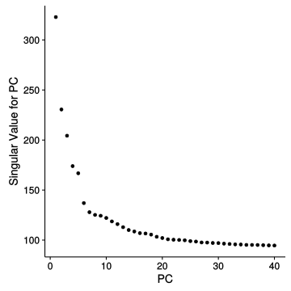
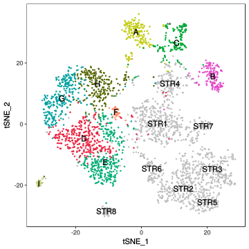
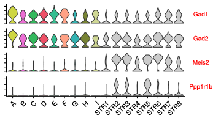
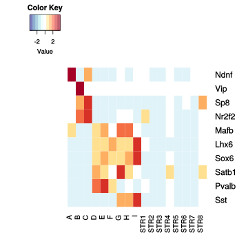

Figure 2. sNucDrop-Seq reveals inhibitory neuronal subtypes and composition.


```r
library("Seurat")
packageVersion("Seurat") # check the Seurat version (We used v1.4.0)
```

```
## [1] '1.4.0'
```

```r
library("tidyr")
library("dplyr")
library("reshape2")
```

#1. Obtain Inh Neurons

```r
# Take out Inhibitory neurons
scNuc2 <- readRDS(file="data/scNuc2.rds")
Inh.clusters <- paste0("Inh",1:7)
Inh.cells <- scNuc2@data.info[scNuc2@data.info$res.comb2 %in% Inh.clusters,]$cell # 1974 nuclei
```

#2. Obtain STR Neurons serve as negative control

```r
# load scNuc.pc30 which was generated in the section '1.1.5. Select PCs and
# clustering' of file 'MolCell_Fig1.md'
scNuc.pc30 <- readRDS(file = "data/scNuc.rds")
```


```r
TSNEPlot(scNuc.pc30,do.label=T)
```


```r
FeaturePlot(scNuc.pc30,c("Gad1","Gad2","Meis2"),cols.use = c("lightgrey","blue"),pt.size=0.5,no.axes = T,nCol = 3)
```


```r
STR.clusters <- c(9,10)
STR.cells <- scNuc.pc30@data.info[scNuc.pc30@data.info$res.2 %in% STR.clusters,]$cell # 1415 nuclei
```


# 3 Setup Seurat object

```r
# load the matrix
tmp1 <- readRDS(file = "data/combined_raw_nUMI_matrix.rds")
tmp1.STRnInh <- tmp1[, unique(c(Inh.cells, STR.cells))]
dim(tmp1.STRnInh)  # 3389 cells
# Set up the Ser

setupSer <- function(tmp1, i, min.genes = 800) {
    ctx <- new("seurat", raw.data = tmp1)
    ctx <- Setup(ctx, min.genes = min.genes, min.cells = 10, project = i)
}


Inh_STR <- setupSer(tmp1.STRnInh, "Inh_STR")

head(Inh_STR@data.info)
mito.genes <- grep("^MT-", rownames(Inh_STR@data), value = T, ignore.case = T)
percent.mito <- colSums(as.matrix(expm1(Inh_STR@data[mito.genes, ])))/colSums(as.matrix(expm1(Inh_STR@data)))
Inh_STR <- AddMetaData(Inh_STR, percent.mito, "percent.mito")
Inh_STR <- SubsetData(Inh_STR, subset.name = "nGene", accept.high = 6000)
Inh_STR <- SubsetData(Inh_STR, subset.name = "percent.mito", accept.high = 0.1)
Inh_STR
Inh_STR@data.info <- sub.info
Inh_STR <- RegressOut(Inh_STR, latent.vars = c("percent.mito", "nUMI", "ID"))
# Identify the highly vairable genes
Inh_STR <- MeanVarPlot(Inh_STR, x.low.cutoff = 0.0125, x.high.cutoff = 4, y.cutoff = 0.9)
length(Inh_STR@var.genes)
Inh_STR <- PCAFast(Inh_STR, pc.genes = Inh_STR@var.genes, do.print = TRUE, pcs.compute = 40, 
    pcs.print = 5, genes.print = 5)
Inh_STR <- ProjectPCA(Inh_STR)
Inh_STR <- JackStraw(Inh_STR, num.pc = 40, num.replicate = 100, prop.freq = 0.01, 
    do.fast = T, do.print = FALSE)
```


```r
PCElbowPlot(Inh_STR,num.pc=40)
```




```r
JackStrawPlot(Inh_STR, PCs = 1:40)
```


#4. Clustering using first 23 PCs and Res 2


```r
Inh_STR.pc23 <- RunTSNE(Inh_STR, dims.use = 1:23, do.fast = T)
Inh_STR.pc23 <- FindClusters(Inh_STR.pc23, pc.use = 1:23, resolution = 2, save.SNN = T, 
    do.sparse = T)
```

#5. Vlnplot and Heatmap plot function

```r
library("reshape2")
plot_vln <- function(t, my.genes3) {
    d <- as.matrix(t@data[intersect(my.genes3, rownames(t@data)), ])
    dd <- melt(d, id = row.names)
    dd <- dd %>% dplyr::rename(gene = Var1, cell = Var2)
    dd$tree.ident <- t@ident[dd$cell]
    str(dd$tree.ident)
    dd$gene <- factor(dd$gene, levels = intersect(my.genes3, rownames(t@data)))
    ggplot(dd, aes(tree.ident, value, fill = tree.ident)) + geom_violin(scale = "width", 
        trim = T, alpha = 0.8, adjust = 1) + facet_wrap(~gene, scales = "free_y", 
        ncol = 1, strip.position = "right") + theme(strip.background = element_blank(), 
        strip.placement = "outside", axis.text.y = element_blank(), axis.title.y = element_blank(), 
        strip.text.y = element_text(colour = "red", angle = 360, size = 10), 
        legend.position = "none", panel.grid = element_blank(), panel.border = element_blank()) + 
        theme(axis.text.x = element_text(angle = 45, hjust = 1, vjust = 1, size = rel(0.9)), 
            legend.position = "none") + xlab("")
}
```


```r
library("gplots")
my.colours = c("#313695", "#4575B4", "#74ADD1", "#ABD9E9", "#E0F3F8", "#FFFFFF", 
    "#FEE090", "#FDAE61", "#F46D43", "#D73027", "#A50026")
plot_heatmap = function(t, my.genes7, my.colours = my.colours, COL = T, ROW = T, 
    DEND = "none") {
    my.genes6 <- intersect(unique(my.genes7), rownames(t@data))
    Mat <- t@data[unique(my.genes6), ]
    Mat <- as.data.frame(as.matrix(Mat))
    Mat$gene <- rownames(Mat)
    Mat <- melt(Mat, id = "gene")
    Mat$cluster <- t@ident[Mat$variable]
    Mat <- Mat %>% group_by(gene, cluster) %>% dplyr::summarise(meanExp = mean(value)) %>% 
        ungroup
    Mat <- as.data.frame(Mat)
    Mat <- dcast(Mat, gene ~ cluster, value.var = "meanExp")
    rownames(Mat) <- Mat$gene
    Mat <- as.matrix(Mat[, -1])
    Mat <- t(scale(t(Mat)))
    Mat <- Mat[unique(my.genes6), levels(t@ident)]
    Mat <- na.omit(Mat)
    heatmap.2(Mat, Colv = COL, Rowv = ROW, dendrogram = DEND, scale = "none", 
        trace = "none", density.info = "none", col = my.colours)
}
```

#6. Pairwise comparison for the Inh Clustering

```r
# plot_vln(Inh_STR.pc23,c('Ndnf','Npy' ,'Reln','Parm1','Vip','Cxcl14',
# 'Sncg', 'Sema3c', 'Tnfaip8l3', 'Pvalb','Tac1', 'Il1rapl2' ,
# 'Cntnap5b','Satb1','Sst','Trhde' , 'Thsd7a' ,'Chodl',
# 'Nos1','Tacr1','Gad1','Gad2','Meis2','Ppp1r1b')) # cluster
# 1,2,4,6,7,9,10,15,16,17
# TSNEPlot(Inh_STR.pc23,do.label=T,pt.size=0.2,no.legend=T)
Inh.clusters <- c(1, 2, 4, 6, 7, 9, 10, 15, 16, 17)

CO <- combn(Inh.clusters, 2)
df <- as.data.frame(t(CO))
dim(CO)[2]
df$DE <- 0
head(df)
for (i in 1:dim(CO)[2]) {
    tete <- FindMarkers(Inh_STR.pc23, df[i, 1], df[i, 2], thresh.use = 0.7)  # e^0.7 according to 2 fold
    df[i, ]$DE <- nrow(tete)
}
df <- df %>% dplyr::arrange(DE)
```


```r
print(head(df))  # don't need to combine any clusters
```

```
##   V1 V2  DE
## 1  1  2  20
## 2  4  6  38
## 3  9 10  97
## 4  1  4 100
## 5  1 15 110
## 6  2 15 110
```

#7. Using DBSCAN to remove the nosie point

```r
library("dbscan")
dat <- Inh_STR.pc23@tsne.rot
res <- dbscan(dat, eps = 1.9, minPts = 10)
table(res$cluster)
used.cells <- rownames(dat[res$cluster != 0, ])
# From 3389 nuclei to 3318 nuclei.
Inh_STR.pc23.sub <- SubsetData(Inh_STR.pc23, cells.use = used.cells)  # 3318 nuclei
```

#8. Remove the doublets

```r
# plot_vln(Inh_STR.pc23.sub,Inh.genes2)
table(Inh_STR.pc23.sub@ident)  # remove cluster 17, contamination (co-express Chat and Cxcl14)
# remove cluster 18, non-gad2 expression
use.cells <- names(Inh_STR.pc23.sub@ident[Inh_STR.pc23.sub@ident %in% 0:16])
Inh_STR.final <- SubsetData(Inh_STR.pc23.sub, cells.use = use.cells)
```


#9. Figure 2A. Spectral tSNE plot of 1,810 cortical GABAergic neurons and 1,462 non-cortical nuclei

```r
Inh.index <- c(7,10,9,1,2,15,4,6,16,0, 3, 5, 8, 11, 12, 13, 14)
Inh.name <- c("A","B","C","D","E","F","G","H","I","STR1","STR2","STR3","STR4","STR5","STR6","STR7","STR8")
Inh_STR.final@data.info$res.comb <- Inh_STR.final@data.info$res.2
Inh_STR.final@data.info$res.comb <- plyr::mapvalues(Inh_STR.final@data.info$res.comb, from=Inh.index, to=Inh.name)
Inh_STR.final <- SetAllIdent(Inh_STR.final,id="res.comb")
Inh.col <- c("#c2cc15","#e44ac8","#00a835","#e92541","#01ac75","#ff8b68","#00a09f","#556400","#c3cd7a",rep("grey",8))
TSNEPlot(Inh_STR.final,do.label=T,pt.size=0.5,do.ret=T,no.legend=T) + scale_colour_manual(values=as.character(Inh.col))
```




```r
#genes.Figure 2a <- c("Ndnf","Npy" ,"Reln","Parm1","Vip","Cxcl14", "Sncg", "Sema3c", "Tnfaip8l3", "Pvalb","Tac1", "Il1rapl2" , "Cntnap5b","Satb1","Sst","Trhde" , "Thsd7a" ,"Chodl", "Nos1","Tacr1","Gad1","Gad2","Meis2","Ppp1r1b")
genes.Figure2a <- c("Gad1","Gad2","Meis2","Ppp1r1b")
plot_vln(Inh_STR.final,genes.Figure2a) + scale_fill_manual(values=as.character(Inh.col))
```

```
##  Factor w/ 17 levels "A","B","C","D",..: 1 1 1 1 1 1 1 1 1 1 ...
```



# 10. Figure 2B. Featureplot of Inh markers

```r
FeaturePlot(Inh_STR.final,c("Slc17a7","Gad2","Ppp1r1b","Meis2","Pvalb","Ndnf","Sst","Vip","Reln"),cols.use = c("lightgrey","blue"),pt.size=.5,no.axes = T)
```


## 11. Figure 2C. Vlnplot of marker genes

```r
genes.Figure2c <- c("Ndnf","Npy" ,"Reln","Parm1","Vip","Cxcl14", "Sncg", "Sema3c", "Tnfaip8l3", "Pvalb","Tac1", "Il1rapl2" , "Cntnap5b","Satb1","Sst","Trhde" , "Thsd7a" ,"Chodl", "Nos1","Tacr1")
Inh_STR.final2 <- SubsetData(Inh_STR.final,cells.use = names(Inh_STR.final@ident[Inh_STR.final@ident %in% c("A","B","C","D","E","F","G","H","I")]))
plot_vln(Inh_STR.final2,genes.Figure2c) + scale_fill_manual(values=as.character(Inh.col))
```

```
##  Factor w/ 9 levels "A","B","C","D",..: 1 1 1 1 1 1 1 1 1 1 ...
```


## 12. Figure 2D. Summary of inhibitory neuron subtypes

```r
Inh_STR.final 
```

```
## An object of class seurat in project Inh_STR
##  19339 genes across 3272 samples.
```

```r
# Inh : 1810 nuclei
# Contamination: 1462 nuclei
table(Inh_STR.final@ident)
```

```
## 
##    A    B    C    D    E    F    G    H    I STR1 STR2 STR3 STR4 STR5 STR6 
##  196  150  168  346  345   37  288  245   35  410  299  257  175  108  100 
## STR7 STR8 
##   65   48
```

```r
# cluster 7, Ndnf, Parm1 (196/1810= 10.83%)
# cluster 10, Vip, Cxcl14 (150/1810= 8.29%)
# cluster 9, Sncg Sema3c, Tnfaip8l3 (168/1810= 9.28%)
# cluster 1,  Pvalb, Tac1 (346)
# cluster 2,  Pvalb, Il1rapl2 (345)
# cluster 15, Pvalb, Cntnap5b (37)
# in total , pv (346+345+37)/1810= 728/1810 = 40.22%
# cluster 4, Sst, Trhde (288)
# cluster 6, Sst, Thsd7a (245)
# cluster 16, Sst, Chodl, Nos1, Tacr1 (35)
# in total;, sst (288+245+35)/1810 = 568/1810 = 31.38%
```

# 13. Figure 2F. Heatmap showing CEG or MGE

```r
Figure2f.genes <- c("Ndnf","Vip","Sp8","Nr2f2","Mafb","Lhx6","Sox6","Satb1","Pvalb","Sst")
plot_heatmap(Inh_STR.final,Figure2f.genes,my.colours=my.colours,COL=F,ROW=F,DEND="none")
```



