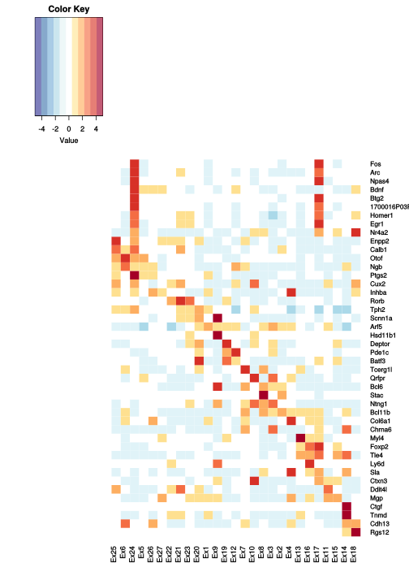
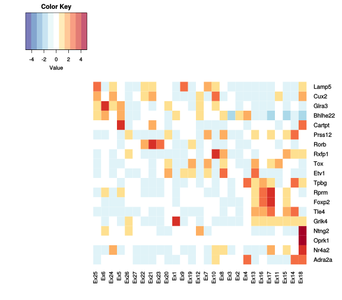
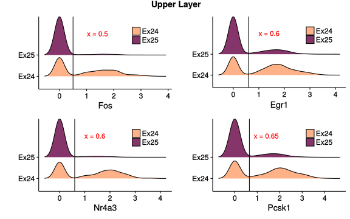

#1. Plot Function

```r
library("gplots")
my.colours = c("#313695", "#4575B4", "#74ADD1", "#ABD9E9", "#E0F3F8", "#FFFFFF", 
    "#FEE090", "#FDAE61", "#F46D43", "#D73027", "#A50026")
plot_heatmap = function(t, my.genes7, my.colours = my.colours, COL = T, ROW = T, 
    DEND = "none") {
    my.genes6 <- intersect(unique(my.genes7), rownames(t@data))
    Mat <- t@data[unique(my.genes6), ]
    Mat <- as.data.frame(as.matrix(Mat))
    Mat$gene <- rownames(Mat)
    Mat <- melt(Mat, id = "gene")
    Mat$cluster <- t@ident[Mat$variable]
    Mat <- Mat %>% group_by(gene, cluster) %>% dplyr::summarise(meanExp = mean(value)) %>% 
        ungroup
    Mat <- as.data.frame(Mat)
    Mat <- dcast(Mat, gene ~ cluster, value.var = "meanExp")
    rownames(Mat) <- Mat$gene
    Mat <- as.matrix(Mat[, -1])
    Mat <- t(scale(t(Mat)))
    Mat <- Mat[unique(my.genes6), levels(t@ident)]
    Mat <- na.omit(Mat)
    heatmap.2(Mat, Colv = COL, Rowv = ROW, dendrogram = DEND, scale = "none", 
        trace = "none", density.info = "none", col = my.colours)
}
```


```r
library("reshape2")
plot_vln <- function(t, my.genes3) {
    d <- as.matrix(t@data[intersect(my.genes3, rownames(t@data)), ])
    dd <- melt(d, id = row.names)
    dd <- dd %>% dplyr::rename(gene = Var1, cell = Var2)
    dd$tree.ident <- t@ident[dd$cell]
    str(dd$tree.ident)
    dd$gene <- factor(dd$gene, levels = intersect(my.genes3, rownames(t@data)))
    ggplot(dd, aes(tree.ident, value, fill = tree.ident)) + geom_violin(scale = "width", 
        trim = T, alpha = 0.8, adjust = 1) + facet_wrap(~gene, scales = "free_y", 
        ncol = 1, strip.position = "right") + theme(strip.background = element_blank(), 
        strip.placement = "outside", axis.text.y = element_blank(), axis.title.y = element_blank(), 
        strip.text.y = element_text(colour = "red", angle = 360, size = 10), 
        legend.position = "none", panel.grid = element_blank(), panel.border = element_blank()) + 
        theme(axis.text.x = element_text(angle = 45, hjust = 1, vjust = 1, size = rel(0.9)), 
            legend.position = "none") + xlab("")
}
```

#2. Figure 3A Heatmap for layer-specific markers and neuronal activity-regulated genes


```r
scNuc2 <- readRDS("data/scNuc2.rds")
ex.clusters <- grep("^Ex", levels(scNuc2@ident), value = T, ignore.case = T)
use.cells <- names(scNuc2@ident[scNuc2@ident %in% ex.clusters])  # 15353 nuclei
scNuc2.ex <- SubsetData(scNuc2, cells.use = use.cells)
```


```r
ex.index <- paste0("Ex",c(25,6,24,5,26,27,22,21,23,20,1,9,19,12,7,10,8,3,2,4,13,16,17,11,15,14,18))
scNuc2.ex@ident <- factor(scNuc2.ex@ident,levels=ex.index)
Fig5a.genes <- c("Fos","Arc","Npas4","Bdnf","Btg2","1700016P03Rik","Homer1","Egr1","Nr4a2","Enpp2","Calb1","Otof","Ngb","Ptgs2","Cux2","Inhba","Rorb","Tph2","Scnn1a","Arf5","Hsd11b1","Deptor","Pde1c","Batf3","Tcerg1l","Qrfpr","Bcl6","Stac","Ntng1","Bcl11b","Col6a1","Chrna6","Myl4","Foxp2","Tle4","Ly6d","Sla","Ctxn3","Ddit4l","Mgp","Ctgf","Tnmd","Cdh13","Rgs12")
plot_heatmap(scNuc2.ex,Fig5a.genes,my.colours=my.colours,COL=F,ROW=F,DEND="none")
```



#3. Figure S3D Heatmap showing select human marker gene expression for cortical excitatory neuronal subpopulations


```r
genes.figs9 <- c("Lamp5","Cux2","Glra3","Bhlhe22","Cartpt","Prss12","Rorb","Rxfp1","Tox","Etv1","Tpbg","Rprm","Foxp2","Tle4","Grik4","Ntng2","Oprk1","Nr4a2","Adra2a")
plot_heatmap(scNuc2.ex,genes.figs9,my.colours = my.colours,ROW = F,COL=F)
```



#4. Figure 3C. Comparison between activity dependent genes and non-activity dependent genes of Upper layer (Ex24 versus Ex25)


```r
ex24_25 <- FindMarkers(scNuc2.ex, "Ex24", "Ex25", thresh.use = 0, min.pct = 0.1)
ex24_25$gene <- rownames(ex24_25)
ex24_25$significant <- "Insignificant"
ex24_25[ex24_25$avg_diff > 0.25 & ex24_25$p_val < 0.001, ]$significant <- "Active"
ex24_25[ex24_25$avg_diff < -0.25 & ex24_25$p_val < 0.001, ]$significant <- "Inactive"
```


```r
p11 <- ggplot(ex24_25,aes(avg_diff,-log10(p_val))) + geom_point(aes(color=significant),alpha=0.8,size=0.7,shape=1) + geom_hline(yintercept = -log10(1e-3),linetype=3)+geom_vline(xintercept = c(-0.25,0.25),linetype=3) + xlim(-2,2) + scale_color_manual(values=c("#ffb288","#853569","grey50")) + theme(legend.position="top",legend.title=element_blank()) + xlab("Log fold change") + ylab("-Log10(P Value)") + ggtitle("Upper layer excitatory neurons")

tmp <- SubsetData(scNuc2.ex,cells.use=names(scNuc2.ex@ident[scNuc2.ex@ident %in% c("Ex24","Ex25")]))
tmp@ident <- factor(tmp@ident,levels=c("Ex25","Ex24"))
p12 <- plot_vln(tmp,c(rownames(ex24_25)[1:15],"Bdnf"))  + scale_fill_manual(values=c("#853569","#ffb288"))
```

```
##  Factor w/ 2 levels "Ex25","Ex24": 1 1 1 1 1 1 1 1 1 1 ...
```

```r
pp.comp <- plot_grid(p11,p12,rel_widths = c(2.5,1))
print(pp.comp)
```


#5 Figure 3D Co-expression analysis of neuronal activity-dependent genes in excitatory neuronal subtypes


```r
ex24_25.cells <- names(scNuc2@ident[scNuc2@ident %in% c("Ex24", "Ex25")])
scNuc2.ex24_25 <- SubsetData(scNuc2, cells.use = ex24_25.cells)
genelist = c("Fos", "Egr1", "Nr4a3", "Pcsk1")
ex24_25.data <- as.matrix(scNuc2.ex24_25@data[genelist, ])
ex24_25.data2 <- melt(ex24_25.data) %>% dplyr::rename(gene = Var1, cell = Var2) %>% 
    left_join(scNuc2.ex24_25@data.info, by = "cell")
t2 <- dcast(ex24_25.data2, cell + res.comb2 ~ gene, value.var = "value")
```


```r
library(ggjoy)
pp1 <- ggplot(t2, aes(x = Fos, y = res.comb2,fill=res.comb2)) + geom_joy() + geom_vline(xintercept=0.5) + scale_fill_manual(name="",values=c("#ffb288","#853569")) + theme(legend.position = c(.8,.8)) + ylab("")  + annotate("text", x = 1.4, y = 3, label = "x = 0.5",col="red",size=4)


pp3<- ggplot(t2, aes(x = Egr1, y = res.comb2,fill=res.comb2)) + geom_joy() + geom_vline(xintercept=0.6) + scale_fill_manual(name="",values=c("#ffb288","#853569")) + theme(legend.position = c(.8,.8)) + ylab("") + annotate("text", x = 1.4, y = 3, label = "x = 0.6",col="red",size=4)

pp4 <- ggplot(t2, aes(x = Nr4a3, y = res.comb2,fill=res.comb2)) + geom_joy() + geom_vline(xintercept=0.6) + scale_fill_manual(name="",values=c("#ffb288","#853569")) + theme(legend.position = c(.8,.8)) + ylab("") + annotate("text", x = 1.4, y = 3, label = "x = 0.6",col="red",size=4)

pp5 <- ggplot(t2, aes(x = Pcsk1, y = res.comb2,fill=res.comb2)) + geom_joy() + geom_vline(xintercept=0.65) + scale_fill_manual(name="",values=c("#ffb288","#853569")) + theme(legend.position = c(.8,.8)) + ylab("") + annotate("text", x = 1.4, y = 3, label = "x = 0.65",col="red",size=4)

pp.total<-plot_grid(pp1,pp3,pp4,pp5,align = "v") + ggtitle("Upper Layer")
```

```
## Picking joint bandwidth of 0.18
```

```
## Picking joint bandwidth of 0.19
```

```
## Picking joint bandwidth of 0.197
```

```
## Picking joint bandwidth of 0.239
```

```r
print(pp.total)
```



```r
t2$FosEgr1 <- "Fos-Egr1-"
t2[t2$Fos>=0.5 & t2$Egr1 >= 0.6,]$FosEgr1 <- "Fos+Egr1+"
t2[t2$Fos>=0.5 & t2$Egr1 < 0.6,]$FosEgr1 <- "Fos+Egr1-"
t2[t2$Fos<0.5 & t2$Egr1 >= 0.6,]$FosEgr1 <- "Fos-Egr1+"

t2$FosNr4a3 <- "Fos-Nr4a3-"
t2[t2$Fos>=0.5 & t2$Nr4a3 >= 0.6,]$FosNr4a3 <- "Fos+Nr4a3+"
t2[t2$Fos>=0.5 & t2$Nr4a3 < 0.6,]$FosNr4a3 <- "Fos+Nr4a3-"
t2[t2$Fos<0.5 & t2$Nr4a3 >= 0.6,]$FosNr4a3 <- "Fos-Nr4a3+"

t2$FosPcsk1 <- "Fos-Pcsk1-"
t2[t2$Fos>=0.5 & t2$Pcsk1 >= 0.65,]$FosPcsk1 <- "Fos+Pcsk1+"
t2[t2$Fos>=0.5 & t2$Pcsk1 < 0.65,]$FosPcsk1 <- "Fos+Pcsk1-"
t2[t2$Fos<0.5 & t2$Pcsk1 >= 0.65,]$FosPcsk1 <- "Fos-Pcsk1+"

tt <- scNuc2.ex24_25@data.info %>% left_join(t2[,c(1,7:9)],by="cell")
rownames(tt) <- tt$cell
scNuc2.ex24_25@data.info <- tt
```


```r
up1 <- TSNEPlot(scNuc2.ex24_25,do.label=F,pt.size=0.5,do.ret=T)  + xlim(-24,5) + ylim(-10,23)+ scale_color_manual(name="",values=c("#ffb288","#853569"))

up2 <-TSNEPlot(scNuc2.ex24_25,group.by="FosEgr1",do.label=F,pt.size=0.5,do.ret=T) + xlim(-24,5) + ylim(-10,23)+ scale_color_manual(values=c("gray","deepskyblue","darkorchid2","red")) 

up3 <-TSNEPlot(scNuc2.ex24_25,group.by="FosNr4a3",do.label=F,pt.size=0.5,do.ret=T) + xlim(-24,5) + ylim(-10,23)+ scale_color_manual(values=c("gray","deepskyblue","darkorchid2","red"))

up4 <-TSNEPlot(scNuc2.ex24_25,group.by="FosPcsk1",do.label=F,pt.size=0.5,do.ret=T) + xlim(-24,5) + ylim(-10,23)+ scale_color_manual(values=c("gray","deepskyblue","darkorchid2","red"))

pp.total2<-plot_grid(up1,up2,up3,up4,align="v")
print(pp.total2)
```


