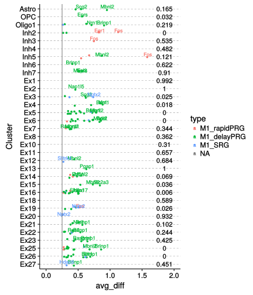
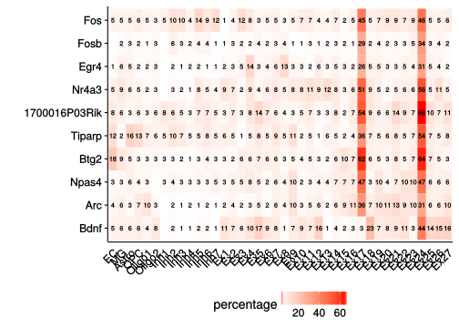
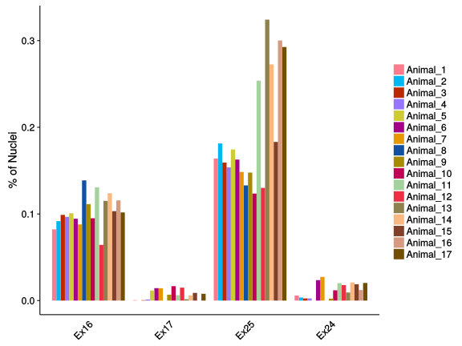

# 1. PTZ and Saline Comparison


```r
scNuc2 <- readRDS("data/scNuc2.rds")

use.cells <- scNuc2@data.info[scNuc2@data.info$treatment %in% c("PTZ", "saline"), 
    ]$cell  # 7624 cells
scNuc2.comp <- SubsetData(scNuc2, cells.use = use.cells)
scNuc2.comp@data.info$type <- paste(scNuc2.comp@data.info$res.comb2, scNuc2.comp@data.info$treatment, 
    sep = "_")
scNuc2.comp <- SetAllIdent(scNuc2.comp, id = "type")
head(scNuc2.comp@data.info)

# only test the cluster including at least 15 nuclei of PTZ and Saline
t <- as.data.frame(t(xtabs(~treatment + res.comb2, data = scNuc2.comp@data.info)))
t2 <- dcast(t, res.comb2 ~ treatment, value.var = "Freq") %>% filter(PTZ >= 
    15, saline >= 15)
test.cluster <- as.character(t2$res.comb2)

# Comparsion between PTZ and saline within each cluster
dge.initial.full <- list()
for (i in test.cluster) {
    cluster1 <- paste(i, "PTZ", sep = "_")
    cluster2 <- paste(i, "saline", sep = "_")
    tete <- FindMarkers(scNuc2.comp, cluster1, cluster2, thresh.use = 0)
    tete$gene <- rownames(tete)
    tete$cluster <- i
    label <- paste("c", i, sep = "")
    dge.initial.full[[label]] = tete
}
dge.initial.full2 <- do.call(rbind.data.frame, dge.initial.full)
```


#2 Load the gene sets of activity-dependent genes

```r
genelist <- read.table("data/ARG_gene_list.txt", header = T)
table(genelist$type)
genelist2 <- genelist[genelist$type %in% c("M1_delayPRG", "M1_rapidPRG", "M1_SRG"), 
    ]
dim(genelist2)
names(genelist2) <- c("gene", "type")
dge.initial3 <- dge.initial.full2 %>% inner_join(genelist2, by = "gene")
dge.initial3.sub <- dge.initial3 %>% filter(avg_diff > 0.25) %>% filter(p_val < 
    0.01) %>% filter(name %in% test.cluster)
table(dge.initial3.sub$name)

# Only show the name of top2 genes
tt <- dge.initial3.sub %>% filter(avg_diff > 0) %>% group_by(cluster) %>% top_n(2, 
    avg_diff) %>% select(name, cluster, gene) %>% mutate(label = gene)
dge.initial3.sub2 <- dge.initial3.sub %>% filter(avg_diff > 0) %>% group_by(gene, 
    cluster) %>% left_join(tt)
dge.initial3.sub2$label[is.na(dge.initial3.sub2$label)] = ""

# read GSEA results
gsea <- read.table("data/GSEA_result.txt", header = T, sep = "\t")
gsea3.3 <- gsea %>% filter(Name == "TOTAL_M") %>% left_join(df.col[, -2], by = "cluster") %>% 
    filter(index.name %in% test.cluster)
fdr <- gsea3.3[, c("index.name", "FDR_qval")] %>% dplyr::rename(name = index.name)
dge.initial3.sub3 <- fdr %>% left_join(dge.initial3.sub2, by = "name")
dge.initial3.sub3$name <- factor(dge.initial3.sub3$name, levels = rev(test.cluster))
dge.initial3.sub3 <- dge.initial3.sub3[order(dge.initial3.sub3$name), ]
dge.initial3.sub3$type <- factor(dge.initial3.sub3$type, levels = c("M1_rapidPRG", 
    "M1_delayPRG", "M1_SRG"))

fdr$name <- factor(fdr$name, levels = rev(test.cluster))
fdr <- fdr[order(fdr$name), ]
fdr$FDR_qval <- round(fdr$FDR_qval, 3)
```

#3 Figure 4B Spectral tSNE plot of GSEA results

```r
ptz.df <- scNuc2.comp@data.info %>% filter(res.comb2 %in% test.cluster) %>% 
    filter(treatment == "PTZ")
coor <- scNuc2.comp@tsne.rot[ptz.df$cell, ]
ptz.df <- cbind(ptz.df, coor)
gsea4 <- gsea3.3 %>% select(index.name, FDR_qval) %>% dplyr::rename(res.comb2 = index.name) %>% 
    group_by(res.comb2) %>% inner_join(ptz.df, by = "res.comb2")
length(unique(gsea4$res.comb2))  # 33 clusters

gsea4$trans.p <- gsea4$FDR_qval
gsea4[gsea4$FDR_qval == 0, ]$trans.p <- 1e-04
plot(gsea4$trans.p)  # summary trans.p
gsea4$log.trans.p <- -log10(gsea4$trans.p)

# take out the ptz treat Seurat
scNuc2.comp2 <- SubsetData(scNuc2, cells.use = ptz.cell)
df.col2 <- df.col[df.col$index.name %in% gsea4$res.comb2, ]
scNuc2.comp2@ident <- factor(scNuc2.comp2@ident, levels = as.character(df.col2$index.name))
```


```r
# colored by the fdr
p91 <- ggplot(gsea4, aes(tSNE_1, tSNE_2)) + geom_point(aes(color=log.trans.p), size=1, shape=16) + scale_color_gradientn(colors=c("#33a0c8","#ed6363","red"),values=c(0,-log10(0.2),-log10(0.05),3),breaks=c(0,-log10(0.2),-log10(0.05),3),labels=c(1,0.2,0.05,0),name="FDR") + ggtitle("FDR of GSEA Enrichment analysis") +  theme(axis.line=element_blank(),axis.text.x=element_blank(),
    axis.text.y=element_blank(),axis.ticks=element_blank(),
    axis.title.x=element_blank(),
    axis.title.y=element_blank())

# colored by the cluster
p92 <- TSNEPlot(scNuc2.comp2,do.label=T,pt.size=.5,do.ret=T,no.legend=T) + ggtitle("Cluster information for PTZ treated nuclei")+ scale_color_manual(values=as.character(df.col2$col))+  theme(axis.line=element_blank(),axis.text.x=element_blank(),axis.text.y=element_blank(),axis.ticks=element_blank(),axis.title.x=element_blank(),axis.title.y=element_blank(),panel.border=element_blank())

fig4b<-plot_grid(p92,p91,align="h")
print(fig4b)
```


#4 Figure 4C Scatter plot showing differentially expressed activity-dependent genes in clusters


```r
dge.initial3.sub3 <- droplevels(dge.initial3.sub3)
ggplot(dge.initial3.sub3,aes(name,avg_diff,label=label)) + theme(panel.grid.major.y = element_line(linetype = "dashed",size=.1)) + geom_jitter(aes(col=type),position = position_jitter(width = 0.2, height = 0.01),size=1) + geom_text(aes(col=type),vjust = 0, nudge_x=0.05,nudge_y = 0.01,size=3) + ylim(0,2) + geom_hline(yintercept=0.25, col="grey50", size=0.5)+ xlab("Cluster") + annotate("text", x = 1:33, y = 1.85, label = fdr$FDR_qval) + coord_flip() 
```



#5 Figure S4C valcano plot of differentially expressed genes (cut-off: p_val < 0.01)


```r
figs4c.cluster <- c("Ex13","Ex16","Ex25","Ex26","Ex27","Ex3","Ex5","Ex6","Inh2","Inh3","Inh5","OPC")
dge.initial.full2.sub <- dge.initial.full2 %>% filter(cluster %in% figs4c.cluster)

dge.initial.full2.sub$significant <- "insignificant"
dge.initial.full2.sub[dge.initial.full2.sub$avg_diff > 0.25 & dge.initial.full2.sub$p_val < 1e-2,]$significant <- "PTZ"
dge.initial.full2.sub[dge.initial.full2.sub$avg_diff < -0.25 & dge.initial.full2.sub$p_val < 1e-2,]$significant <- "saline"
dge.initial.full2.sub$significant <- factor(dge.initial.full2.sub$significant,levels=c("PTZ","saline","insignificant"))

xtabs(~cluster+significant,data=dge.initial.full2.sub)
```

```
##        significant
## cluster  PTZ saline insignificant
##    Ex13   56     59          4534
##    Ex16  144    148          3798
##    Ex25  205    164          4124
##    Ex26  147    163          4311
##    Ex27   64     89          4559
##    Ex3   155    134          5138
##    Ex5   204    206          4440
##    Ex6   190    171          4955
##    Inh2   93    101          4706
##    Inh3   75     62          4647
##    Inh5   88     69          4537
##    OPC    24     56          5514
```

```r
dge.initial.full2.sub.stat <- dge.initial.full2.sub %>% group_by(cluster,significant) %>% dplyr::summarise(count=n())
dge.initial.full2.sub.stat <- as.data.frame(dge.initial.full2.sub.stat)
dge.initial.full2.sub.stat2 <- dcast(dge.initial.full2.sub.stat, cluster ~ significant, value.var="count")

ggplot(dge.initial.full2.sub,aes(avg_diff,-log10(p_val))) + geom_point(aes(color=significant),alpha=0.8,size=0.7,shape=1) + geom_hline(yintercept = -log10(1e-3),linetype=3)+geom_vline(xintercept = c(-0.25,0.25),linetype=3) + xlim(-2,2) + ylim(0,50)+ scale_color_manual(values=c("purple","goldenrod3","grey80"))  + facet_wrap(~cluster,nrow=3) + geom_text(data=dge.initial.full2.sub.stat2, aes(label=PTZ),col="purple",x=1.5,y=40) + geom_text(data=dge.initial.full2.sub.stat2, aes(label=saline),col="goldenrod3",x=-1.5,y=40) + theme_bw() + theme(legend.position="top",legend.title=element_blank(),panel.grid.major = element_blank(), panel.grid.minor = element_blank()) + xlab("Log fold change") + ylab("-Log10(P Value)")
```


#6 Figure S4A Violin plots showing the distribution of the expression level of select IEGs in all cortical cell-types

```r
ieg.genes <- c("Fos", "Fosb", "Egr4", "Nr4a3", "1700016P03Rik", "Tiparp", "Btg2", 
    "Npas4", "Arc", "Bdnf")
ieg.data <- as.matrix(scNuc2@data[ieg.genes, ])
ieg.data2 <- melt(ieg.data) %>% dplyr::rename(gene = Var1, cell = Var2) %>% 
    left_join(scNuc2@data.info, by = "cell")
str(ieg.data2)
ieg.data3 <- ieg.data2[, c(1, 2, 3, 12)]

df.col <- data.frame(cluster = c(40, 37, 22, 36, 19, 43, 42, 12, 14, 16, 24, 
    26, 27, 30, 21, 34, 35, 13, 20, 5, 41, 39, 28, 15, 32, 17, 18, 33, 1, 38, 
    31, 7, 25, 4, 6, 10, 23, 0, 8, 9), col = c("#d4ca36", "#5b3abe", "#83c320", 
    "#0049c0", "#cfbc00", "#b67fff", "#01c85e", "#e549c6", "#7fdb70", "#be0080", 
    "#008d37", "#ff8dfd", "#a09800", "#8f8eff", "#f79d06", "#0093e8", "#fb692b", 
    "#5cbcff", "#de3725", "#63d5f1", "#c40041", "#8bd6a8", "#d8006e", "#0d601f", 
    "#e89bff", "#737700", "#364e9a", "#f3bd66", "#01608f", "#9f6b00", "#008dab", 
    "#ff757a", "#515703", "#f0b3e8", "#754a00", "#8d81b5", "#ffb288", "#853569", 
    "#ffa2bc", "#952a49"), index.name = c("EC", "MG", "Astro", "OPC", "Oligo1", 
    "Oligo2", paste("Inh", 1:7, sep = ""), paste("Ex", 1:27, sep = "")))

head(df.col)
ieg.data3$res.comb2 <- factor(ieg.data3$res.comb2, levels = rev(as.character(df.col$index.name)))
ieg.data.stat <- ieg.data3 %>% group_by(gene) %>% dplyr::summarise(mean = mean(value), 
    media = median(value), sd = sd(value))
ieg.data.stat$cutoff <- ieg.data.stat$mean + 2 * ieg.data.stat$sd
ieg.data3$res.comb2 <- factor(ieg.data3$res.comb2, levels = as.character(df.col$index.name))
```


```r
ggplot(ieg.data3,aes(res.comb2,value,fill=res.comb2))+
    geom_violin(scale="width",trim=T,alpha=0.8,adjust=1)+
    facet_wrap(~gene,scales="free_y",ncol=1,strip.position = "right") +
    theme(strip.background = element_blank(), strip.placement = "outside",
          axis.text.y=element_blank(),axis.title.y=element_blank(),
          strip.text.y = element_text(colour = "red", angle = 360,size=10),legend.position="none",panel.grid=element_blank(), panel.border=element_blank()) +
    theme(axis.text.x = element_text(angle = 45,hjust=1,vjust=1,size=rel(0.9)),legend.position="none") + xlab("") + scale_fill_manual(values=as.character(df.col$col)) + geom_hline(data=ieg.data.stat, aes(yintercept=cutoff), color='coral', linetype="dotted",size=.5)
```


#7 Figure S4A Heatmap showing percentage of nuclei expressing select IEGs in all cortical cell-types

```r
## set mean+2sd as cut-off
ieg.data4 <- ieg.data3 %>% group_by(gene) %>% left_join(ieg.data.stat[, c(1, 
    5)])
ieg.data4$value2 <- ieg.data4$value - ieg.data4$cutoff
ieg.data4$activity = "no"
ieg.data4[ieg.data4$value2 > 0, ]$activity = "yes"

ieg.data5 <- ieg.data4 %>% group_by(gene, res.comb2, activity) %>% dplyr::summarise(count = n())
ieg.data6 <- ieg.data4 %>% group_by(gene, res.comb2) %>% dplyr::summarise(count.total = n())
ieg.data7 <- ieg.data5 %>% group_by(gene, res.comb2) %>% left_join(ieg.data6)
ieg.data7$percentage <- round(ieg.data7$count/ieg.data7$count.total * 100, 2)
ieg.data8 <- ieg.data7 %>% filter(activity == "yes")

summary(ieg.data8$percentage)
ieg.data8$gene <- factor(ieg.data8$gene, levels = rev(ieg.genes))
```


```r
ggplot(ieg.data8,aes(res.comb2,gene,fill=percentage)) + geom_tile() + theme(legend.position="bottom",axis.text.x=element_text(angle=45,hjust=1,vjust=1),axis.ticks.x=element_blank(),axis.title.x=element_blank()) + scale_fill_gradient(low="white",high="red") + geom_text(aes(label=round(percentage,0)),size=2.5) + ylab("")
```



#8 Figure S4B Percentage of nuclei for each animal (colored according to animal ID in Figure S2A) in clusters Ex16, Ex17, Ex 24 and Ex 25


```r
ddf <- as.data.frame(table(scNuc2@data.info$res.comb2,scNuc2@data.info$ID))
ddf2 <- ddf %>% group_by(Var2) %>% dplyr::summarise(total=sum(Freq))
ddf3 <- ddf %>% group_by(Var2)  %>% left_join(ddf2,by="Var2")
ddf3$percent <- ddf3$Freq/ddf3$total
ddf4 <- ddf3 %>% filter(Var1 %in% c("Ex16","Ex17","Ex24","Ex25"))
ddf4$Var2 <- as.character(ddf4$Var2)
ddf4 <- droplevels(ddf4)
ddf4$Var1 <- factor(ddf4$Var1,levels=c("Ex16","Ex17","Ex25","Ex24"))
ddf4$Var2 <- factor(ddf4$Var2,levels=paste("Animal",1:17,sep="_"))

ggplot(ddf4,aes(Var1,percent,fill=Var2)) + geom_bar(position=position_dodge(), stat = "identity")+   theme(axis.text.x=element_text(angle = 45,hjust=1,vjust=1),axis.ticks.x=element_blank(),axis.title.x=element_blank(),legend.title=element_blank())+ylab("% of Nuclei") +  scale_fill_manual(values=c("#ff7b8b","#00b7f1","#bc2900","#9675ff","#cecc35","#a40089","#e59800","#10529f","#a88b00","#c00054","#a3d29c","#ee2f43","#8f814d","#fbb880","#814128","#d89981","#714e00"))
```



