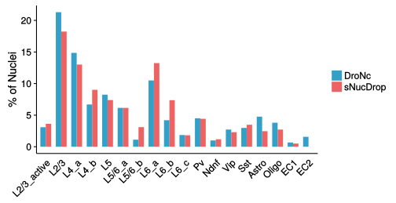
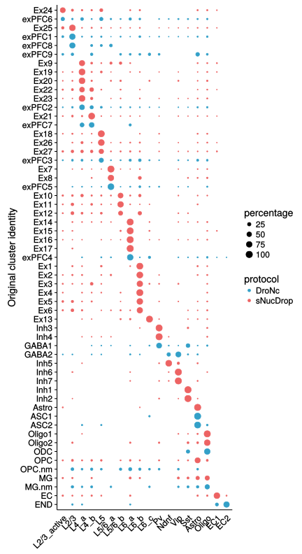

By utilizing a recently published computational strategy for integrated analysis of multiple data sets (implemented in Seurat v2.0), we further performed comparative analysis of the DroNc-Seq data set (Habib et al., 2017) and this study (Figures S3E-G). We downloaded the raw DroNc-seq data (mouse prefrontal cortex) and generated the digital expression matrix using our pipeline that utilizes both exonic and intronic reads.


```r
library("Seurat")
packageVersion("Seurat") # check the Seurat version (HERE IS v2.0.1 !)
```

```
## [1] '2.0.1'
```

```r
library("tidyr")
library("dplyr")
library("reshape2")
```


#1 Set up Seurat object 

```r
tmp1 <- readRDS("data/DroNcseq_reanalysis_nUMI.rds")
Nm <- CreateSeuratObject(raw.data = tmp1, min.cells = 10, min.genes = 800)  # 5509 nuclei from pre-front cortex were kept in DroNc-Seq data set

mito.genes <- grep("^MT-", rownames(Nm@data), value = T, ignore.case = T)
percent.mito <- colSums(Nm@raw.data[mito.genes, ])/colSums(Nm@raw.data)
Nm <- AddMetaData(Nm, percent.mito, "percent.mito")

Nm <- FilterCells(Nm, "percent.mito", high.thresholds = 0.1)
Nm <- FilterCells(Nm, "nGene", high.thresholds = 5000)
Nm  # 5441 nuclei was kept

Nm <- NormalizeData(Nm)
Nm <- ScaleData(Nm, vars.to.regress = c("nUMI", "percent.mito"))
Nm <- FindVariableGenes(object = Nm, do.plot = FALSE)

scNuc2 <- readRDS(file = "data/scNuc2.rds")
Mm <- UpdateSeuratObject(scNuc2)  # upgrade to the version 2.0 object

# The union of the top 1,000 genes with the highest dispersion from both
# datasets was subject to a canonical correlation analysis (CCA) to identify
# common sources of variation between the two datasets
hvg.mm <- rownames(x = head(x = Mm@hvg.info, n = 1000))
hvg.nm <- rownames(x = head(x = Nm@hvg.info, n = 1000))
hvg.union <- union(x = hvg.mm, y = hvg.nm)
length(hvg.union)

Nm@meta.data[, "protocol"] <- "DroNc"
Mm@meta.data[, "protocol"] <- "sNucDrop"

Ser.comp <- RunCCA(object = Mm, object2 = Nm, genes.use = hvg.union)
```

#2. Select PCs


```r
DimHeatmap(object = Ser.comp, reduction.type = "cca", cells.use = 500, dim.use = 1:9, do.balanced = TRUE)
```


```r
DimHeatmap(object = Ser.comp, reduction.type = "cca", cells.use = 500, dim.use = 10:18, do.balanced = TRUE)
```


#3 Align CCA and clustering

```r
Ser.comp <- CalcVarExpRatio(object = Ser.comp, reduction.type = "pca", grouping.var = "protocol", 
    dims.use = 1:15)
Ser.comp <- SubsetData(object = Ser.comp, subset.name = "var.ratio.pca", accept.low = 0.5)
Ser.comp <- AlignSubspace(object = Ser.comp, reduction.type = "cca", grouping.var = "protocol", 
    dims.align = 1:15)
Ser.comp <- RunTSNE(object = Ser.comp, reduction.use = "cca.aligned", dims.use = 1:15, 
    do.fast = TRUE)
Ser.comp <- FindClusters(object = Ser.comp, reduction.type = "cca.aligned", 
    dims.use = 1:15, save.SNN = TRUE, resolution = 1.2)
```


#4 Plot function

```r
plot_vln<-function(t,my.genes3) {
  d <- as.matrix(t@data[intersect(my.genes3,rownames(t@data)),])
  dd <- melt(d,id=row.names)
  dd <- dd %>% dplyr::rename(gene=Var1,cell=Var2)
  dd$tree.ident <- t@ident[dd$cell]
  str(dd$tree.ident)
  dd$gene <- factor(dd$gene,levels=intersect(my.genes3,rownames(t@data)))
  ggplot(dd,aes(tree.ident,value,fill=tree.ident))+
    #geom_violin(scale="width",alpha=0.8,adjust=2)+
    geom_violin(scale="width",trim=T,alpha=0.8,adjust=1)+
    facet_wrap(~gene,scales="free_y",ncol=1,strip.position = "right") +
    theme(strip.background = element_blank(), strip.placement = "outside",
          axis.text.y=element_blank(),axis.title.y=element_blank(),
          strip.text.y = element_text(colour = "red", angle = 360,size=10),legend.position="none",panel.grid=element_blank(), panel.border=element_blank()) +
  #scale_y_log10()
    theme(axis.text.x = element_text(angle = 45,hjust=1,vjust=1,size=rel(0.9)),legend.position="none") + xlab("")
}
```


```r
library("gplots")
my.colours= c("#313695", "#4575B4", "#74ADD1", "#ABD9E9", "#E0F3F8", "#FFFFFF","#FEE090", "#FDAE61", "#F46D43", "#D73027", "#A50026")
plot_heatmap = function(t,my.genes7,my.colours=my.colours,COL=T,ROW=T,DEND="none"){
  my.genes6 <- intersect(unique(my.genes7),rownames(t@data))
  Mat <- t@data[unique(my.genes6),]
  Mat <- as.data.frame(as.matrix(Mat))
  Mat$gene <- rownames(Mat)
  Mat <- melt(Mat,id="gene")
  Mat$cluster <- t@ident[Mat$variable]
  Mat <- Mat %>% group_by(gene,cluster) %>% dplyr::summarise(meanExp=mean(value)) %>% ungroup
  Mat <- as.data.frame(Mat)
  Mat <- dcast(Mat, gene ~ cluster, value.var="meanExp")
  rownames(Mat) <- Mat$gene
  Mat <- as.matrix(Mat[,-1])
  Mat <- t(scale(t(Mat))) 
  Mat <- Mat[unique(my.genes6),levels(t@ident)]
  Mat <- na.omit(Mat)
  heatmap.2(Mat,Colv=COL,Rowv=ROW,dendrogram=DEND,scale="none",trace="none",density.info="none",col=my.colours)
}
```
#5 Annotate clusters


```r
gene.maks <- c("Flt1","Ctss","Apoe","Gja1","Pdgfra","Mbp","Mog","Opalin","Enpp6","Gad1","Gad2","Sst","Chod1","Pvalb","Ndnf","Vip","Sncg","Slc17a7","Lmo7","Ntng1","Col6a1","Otof","Fam19a1","Ndst4","Bcl6","Vwc2l","Ctgf","Foxp2","Tle4","Nr4a2","Oprk1","Deptor","Tshz2","Rorb","Enpp2","Sema3e","Pld5")

plot_vln(Ser.comp,gene.maks)
```

```
##  Factor w/ 18 levels "0","1","2","3",..: 2 2 2 2 2 2 2 2 2 2 ...
```


```r
# Inh clusters:
#7 Pvalb
#9 Sst
#13 Vip
#15 Ndnf

#ex.genes <- c("Fos","Arc","Npas4","Bdnf","Btg2","1700016P03Rik","Homer1","Egr1","Nr4a2","Enpp2","Calb1","Otof","Ngb","Ptgs2","Cux2","Inhba","Rorb","Tph2","Scnn1a","Arf5","Hsd11b1","Deptor","Pde1c","Batf3","Tcerg1l","Qrfpr","Bcl6","Stac","Ntng","Bcl11b","Col6a1","Chrna6","Myl4","Foxp2","Tle4","Ly6d","Sla","Ctxn3","Ddit4l","Mgp","Ctgf","Tnmd","Cdh13","Rgs12")

#plot_heatmap(Ser.comp,ex.genes,my.colours=my.colours,COL=T,ROW=F,DEND="col")
```


```r
Ser.comp@meta.data$res.name <- plyr::mapvalues(Ser.comp@meta.data$res.1.2, 0:17, 
    c("L2/3", "L4_a", "L6_a", "L4_b", "L5", "L6_b", "L5/6_a", "Pv", "L2/3_active", 
        "Sst", "Astro", "Oligo", "L5/6_b", "Vip", "L6_c", "Ndnf", "EC1", "EC2"))

Ser.comp <- SetAllIdent(Ser.comp, id = "res.name")
```

#6 Figure S3E: TSNE plot of 17,876 sNucDrop-Seq and 5,337 DroNc-Seq nuclei 

```r
p1 <- TSNEPlot(object = Ser.comp, group.by = "protocol", do.return = TRUE, pt.size = 0.2)+ scale_color_manual(values=c("#33a0c8","#ed6363"))
p2 <- TSNEPlot(object = Ser.comp, do.return = TRUE, pt.size = 0.2, do.label = T,no.legend=T)
p.comp <- plot_grid(p1,p2,rel_widths = c(1.3, 1))
print(p,comp)
```

```
## Error in print.ggplot(p, comp): object 'comp' not found
```


#7 Figure S3F: Fraction of either sNucDrop-Seq (red) or DroNc-Seq (blue) nuclei from each cortical celltypes


```r
dff <- Ser.comp@meta.data
dz <- as.data.frame(table(dff$protocol, dff$res.name))
dz2 <- dz %>% group_by(Var1) %>% dplyr::summarise(cell.total = sum(Freq))
dz3 <- dz %>% group_by(Var1) %>% left_join(dz2, by = "Var1")
dz3$percentage <- round(dz3$Freq/dz3$cell.total * 100, 2)

dz3$Var2 <- factor(dz3$Var2, levels = c("L2/3_active", "L2/3", "L4_a", "L4_b", 
    "L5", "L5/6_a", "L5/6_b", "L6_a", "L6_b", "L6_c", "Pv", "Ndnf", "Vip", "Sst", 
    "Astro", "Oligo", "EC1", "EC2"))

ggplot(dz3, aes(Var2, percentage, fill = Var1, label = percentage)) + geom_bar(position = position_dodge(), 
    stat = "identity", width = 0.7) + theme(axis.text.x = element_text(angle = 45, 
    hjust = 1, vjust = 1), axis.ticks.x = element_blank(), axis.title.x = element_blank(), 
    legend.title = element_blank()) + scale_fill_manual(values = c("#33a0c8", 
    "#ed6363")) + ylab("% of Nuclei")
```



#8 Figure S3G: Mapping of original cortical cell-type clusters defined by sNucDrop-Seq (red) and DroNcSeq (blue) to clusters defined by combined data sets in Figure S3E

```r
# obtain original cluster identity for our data set
dff.mm <- scNuc2@data.info
dff.mm$protocol <- "sNucDrop"
dff.mm <- dff.mm[, c("res.comb2", "cell", "protocol")]
names(dff.mm) <- c("orig.ident", "cell", "protocol")

# load the original cluster identity of DroNc-seq
nm.class <- read.table("data/DroNc-seq_Mouse_Meta_Data_with_cluster.txt", header = T, 
    sep = "\t")
nm.class$NAME <- gsub("0-", "X0.", nm.class$NAME)  # replace the symbol '-' since cannot be recongized by R
head(nm.class)
```

```
##                 NAME Cluster ClusterID Genes  UMIs
## 1 X0.1a_TACTGGTCCCCC  exPFC9         9  7658 28160
## 2 X0.1a_AAGTCTTACACT  exPFC9         9  8310 32107
## 3 X0.1a_CGTAGTTATTAG  exPFC7         7  6204 17010
## 4 X0.1a_TGAATTTTTTCT  exPFC9         9  5708 15812
## 5 X0.1a_TTTCTAATCGGA  exPFC9         9  4653 12452
## 6 X0.1a_CAACCTTATGCA    ASC2        16  5273 14539
```

```r
dff.nm <- nm.class[, c(2, 1)]
names(dff.nm) <- c("orig.ident", "cell")
dff.nm$protocol <- "DroNc"
dff.nm$orig.ident <- gsub("OPC", "OPC.nm", dff.nm$orig.ident)
dff.nm$orig.ident <- gsub("MG", "MG.nm", dff.nm$orig.ident)

dff.total <- rbind(dff.mm, dff.nm)

# current combined cluster identity
dff.current <- Ser.comp@meta.data
dff.current$cell <- rownames(Ser.comp@meta.data)
dff.current2 <- dff.current[, c("cell", "protocol", "res.name")]
cell.comp2 <- dff.current2 %>% group_by(protocol, cell) %>% inner_join(dff.total)
```

```
## Joining, by = c("cell", "protocol")
```

```r
table(cell.comp2$protocol)  # Out of 5537 nuclei from DroNc-seq data set, the original identity of 4,405 nuclei was retrieved.
```

```
## 
##    DroNc sNucDrop 
##     4405    17876
```

```r
cell.comp3 <- cell.comp2 %>% group_by(res.name, protocol, orig.ident) %>% dplyr::summarise(cells = n())
cell.comp4 <- cell.comp2 %>% group_by(protocol, orig.ident) %>% dplyr::summarise(cells.total = n())

cell.comp5 <- cell.comp3 %>% group_by(protocol, orig.ident) %>% left_join(cell.comp4)
```

```
## Joining, by = c("protocol", "orig.ident")
```

```r
cell.comp5$percentage <- round(cell.comp5$cells/cell.comp5$cells.total * 100, 
    2)

cell.comp5$res.name <- factor(cell.comp5$res.name, levels = c("L2/3_active", 
    "L2/3", "L4_a", "L4_b", "L5", "L5/6_a", "L5/6_b", "L6_a", "L6_b", "L6_c", 
    "Pv", "Ndnf", "Vip", "Sst", "Astro", "Oligo", "EC1", "EC2"))

# exclude the cluster of non-cortical neurons
cell.comp6 <- cell.comp5[!(cell.comp5$orig.ident %in% c("SMC", "exCA3", "Doublets", 
    "Unclassified3")), ]
cell.comp6 <- droplevels(cell.comp6)
levels(cell.comp6$res.name)
```

```
##  [1] "L2/3_active" "L2/3"        "L4_a"        "L4_b"        "L5"         
##  [6] "L5/6_a"      "L5/6_b"      "L6_a"        "L6_b"        "L6_c"       
## [11] "Pv"          "Ndnf"        "Vip"         "Sst"         "Astro"      
## [16] "Oligo"       "EC1"         "EC2"
```

```r
# order the orignial cluster identity
cell.comp6$orig.ident <- factor(cell.comp6$orig.ident, levels = rev(c("Ex24", 
    "exPFC6", "Ex25", "exPFC1", "exPFC8", "exPFC9", "Ex9", "Ex19", "Ex20", "Ex22", 
    "Ex23", "exPFC2", "Ex21", "exPFC7", "Ex18", "Ex26", "Ex27", "exPFC3", "Ex7", 
    "Ex8", "exPFC5", "Ex10", "Ex11", "Ex12", "Ex14", "Ex15", "Ex16", "Ex17", 
    "exPFC4", "Ex1", "Ex2", "Ex3", "Ex4", "Ex5", "Ex6", "Ex13", "Inh3", "Inh4", 
    "GABA1", "GABA2", "Inh5", "Inh6", "Inh7", "Inh1", "Inh2", "Astro", "ASC1", 
    "ASC2", "Oligo1", "Oligo2", "ODC", "OPC", "OPC.nm", "MG", "MG.nm", "EC", 
    "END")))
```


```r
ggplot(cell.comp6,aes(res.name,orig.ident,size=percentage,color=protocol)) + geom_point() + scale_size(range=c(0.1,4))+ theme(axis.text.x=element_text(angle = 45,hjust=1,vjust=1),axis.ticks.x=element_blank(),axis.title.x=element_blank()) +  scale_color_manual(values=c("#33a0c8","#ed6363")) + ylab("Original cluster identity")
```



